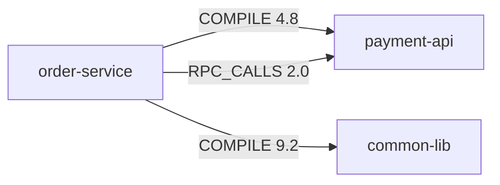
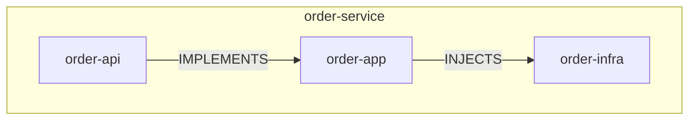

# Java Code Atlas 技术实施方案

> 目标：按 `README.md` 与 `DESIGN.md` 的五层模型落地一个可运行的 Java 结构图谱工具。L1-L3 使用确定性静态分析与图计算，L4 使用 DeepSeek 做结构模式推断，L5 输出 Markdown、Mermaid、JSON 与单文件 HTML。

## 总体架构

Java Code Atlas 由一个 Python 编排 CLI 和一个 Java 分析器 CLI 组成。Java 端负责 JavaParser AST 解析、实体/关系提取、JGraphT 度量计算；Python 端负责多仓编排、DeepSeek 批量推理、模板渲染和 Hermes Skill 封装。

```text
atlas.py
  ├─ 读取单仓或多仓配置
  ├─ 调用 java-code-atlas-analyzer.jar 生成 atlas-raw.json
  ├─ 调用 java-code-atlas-metrics.jar 或同一 JAR 的 metrics 子命令生成 atlas-metrics.json
  ├─ 调用 DeepSeek 生成 atlas-patterns.json
  └─ 渲染 report.md / graph.mmd / graph.html

java-code-atlas-analyzer.jar
  ├─ analyze：JavaParser AST -> entities + relationships
  └─ metrics：JGraphT -> degrees + SCC + Martin A/I + hotspot + boundary score
```

## Phase 1 骨架（3 天）：JavaParser CLI

### 1. Maven 项目搭建

Java 分析器独立放在 `java-analyzer/`，Python CLI 放在仓库根目录。Phase 1 只需要 `analyze` 子命令能扫描一个 Maven/Gradle Java 仓并输出 JSON。

推荐坐标：

```xml
<groupId>io.github.javacodeatlas</groupId>
<artifactId>java-code-atlas-analyzer</artifactId>
<version>0.1.0</version>
```

`java-analyzer/pom.xml`：

```xml
<?xml version="1.0" encoding="UTF-8"?>
<project xmlns="http://maven.apache.org/POM/4.0.0"
         xmlns:xsi="http://www.w3.org/2001/XMLSchema-instance"
         xsi:schemaLocation="http://maven.apache.org/POM/4.0.0 https://maven.apache.org/xsd/maven-4.0.0.xsd">
  <modelVersion>4.0.0</modelVersion>

  <groupId>io.github.javacodeatlas</groupId>
  <artifactId>java-code-atlas-analyzer</artifactId>
  <version>0.1.0</version>
  <packaging>jar</packaging>

  <properties>
    <maven.compiler.source>17</maven.compiler.source>
    <maven.compiler.target>17</maven.compiler.target>
    <project.build.sourceEncoding>UTF-8</project.build.sourceEncoding>
    <javaparser.version>3.26.4</javaparser.version>
    <jackson.version>2.17.2</jackson.version>
    <picocli.version>4.7.6</picocli.version>
  </properties>

  <dependencies>
    <dependency>
      <groupId>com.github.javaparser</groupId>
      <artifactId>javaparser-symbol-solver-core</artifactId>
      <version>${javaparser.version}</version>
    </dependency>
    <dependency>
      <groupId>com.fasterxml.jackson.core</groupId>
      <artifactId>jackson-databind</artifactId>
      <version>${jackson.version}</version>
    </dependency>
    <dependency>
      <groupId>info.picocli</groupId>
      <artifactId>picocli</artifactId>
      <version>${picocli.version}</version>
    </dependency>
    <dependency>
      <groupId>org.junit.jupiter</groupId>
      <artifactId>junit-jupiter</artifactId>
      <version>5.10.3</version>
      <scope>test</scope>
    </dependency>
  </dependencies>

  <build>
    <plugins>
      <plugin>
        <groupId>org.apache.maven.plugins</groupId>
        <artifactId>maven-compiler-plugin</artifactId>
        <version>3.13.0</version>
      </plugin>
      <plugin>
        <groupId>org.apache.maven.plugins</groupId>
        <artifactId>maven-surefire-plugin</artifactId>
        <version>3.3.1</version>
      </plugin>
      <plugin>
        <groupId>org.apache.maven.plugins</groupId>
        <artifactId>maven-shade-plugin</artifactId>
        <version>3.6.0</version>
        <executions>
          <execution>
            <phase>package</phase>
            <goals><goal>shade</goal></goals>
            <configuration>
              <createDependencyReducedPom>false</createDependencyReducedPom>
              <transformers>
                <transformer implementation="org.apache.maven.plugins.shade.resource.ManifestResourceTransformer">
                  <mainClass>io.github.javacodeatlas.cli.AtlasCli</mainClass>
                </transformer>
              </transformers>
            </configuration>
          </execution>
        </executions>
      </plugin>
    </plugins>
  </build>
</project>
```

### 2. JavaParser 遍历 AST 提取实体指纹

实体粒度以顶层类和嵌套类型为主。每个 `ClassOrInterfaceDeclaration`、`EnumDeclaration`、`AnnotationDeclaration`、`RecordDeclaration` 转为一个 `EntityFingerprint`。FQN 通过包名、外部类名和当前类型名拼接；如果 symbol solver 可解析，则优先使用 `resolve().getQualifiedName()`。

扫描流程：

1. 用 `Files.walk(input)` 收集 `src/main/java/**/*.java`，默认排除 `target/`、`build/`、`.gradle/`、`src/test/`。
2. 每个文件用 `StaticJavaParser.parse(path)` 解析为 `CompilationUnit`。
3. 读取 `PackageDeclaration`、imports、模块路径。
4. 遍历所有类型声明，生成实体指纹。
5. 在同一 AST 内提取 9 种关系。
6. 把所有关系按 `(source, target, type)` 聚合，累计 `count` 和 `weight`。

### 3. 数据类代码骨架

`EntityFingerprint.java`：

```java
package io.github.javacodeatlas.model;

import java.util.ArrayList;
import java.util.LinkedHashMap;
import java.util.List;
import java.util.Map;

public final class EntityFingerprint {
    public String id;
    public String fqn;
    public String simpleName;
    public String packageName;
    public String module;
    public String sourcePath;
    public int startLine;
    public int endLine;
    public String kind;
    public List<String> modifiers = new ArrayList<>();
    public List<String> annotations = new ArrayList<>();
    public List<String> roles = new ArrayList<>();
    public List<String> extendsTypes = new ArrayList<>();
    public List<String> implementsTypes = new ArrayList<>();
    public List<String> typeParameters = new ArrayList<>();
    public Metrics fingerprint = new Metrics();

    public static final class Metrics {
        public int methods;
        public int publicMethods;
        public int privateMethods;
        public int protectedMethods;
        public int getters;
        public int setters;
        public int constructors;
        public int overrides;
        public int injectedDeps;
        public boolean constructorInjection;
        public boolean fieldInjection;
        public int loc;
        public double avgMethodLength;
        public int maxMethodLength;
        public int cyclomaticComplexityMax;
        public int nestedDepthMax;
        public int typeParams;
        public int wildcardUsage;
        public int transactionalMethods;
        public int beanMethods;
        public int staticMethods;
        public int finalFields;
        public Map<String, Integer> annotationCounts = new LinkedHashMap<>();
    }
}
```

`Relationship.java`：

```java
package io.github.javacodeatlas.model;

import java.util.ArrayList;
import java.util.List;

public final class Relationship {
    public String id;
    public String source;
    public String target;
    public RelationshipType type;
    public double weight;
    public int count;
    public List<String> evidence = new ArrayList<>();

    public Relationship() {
    }

    public Relationship(String source, String target, RelationshipType type, double weight, String evidence) {
        this.source = source;
        this.target = target;
        this.type = type;
        this.weight = weight;
        this.count = 1;
        this.evidence.add(evidence);
        this.id = source + "|" + type + "|" + target;
    }
}
```

`RelationshipType.java`：

```java
package io.github.javacodeatlas.model;

public enum RelationshipType {
    EXTENDS(1.0),
    INVOKES(1.0),
    IMPLEMENTS(0.8),
    INJECTS(0.6),
    LISTENS(0.3),
    CONFIGURES(0.3),
    ADVISED_BY(0.1),
    RPC_CALLS(0.5),
    TX_BOUNDARY(0.2);

    public final double coefficient;

    RelationshipType(double coefficient) {
        this.coefficient = coefficient;
    }
}
```

`AtlasDocument.java`：

```java
package io.github.javacodeatlas.model;

import java.time.Instant;
import java.util.ArrayList;
import java.util.List;

public final class AtlasDocument {
    public String schemaVersion = "1.0";
    public Instant generatedAt = Instant.now();
    public ScanOptions scanOptions;
    public RepositoryInfo repository;
    public List<EntityFingerprint> entities = new ArrayList<>();
    public List<Relationship> relationships = new ArrayList<>();
    public List<ModuleFingerprint> modules = new ArrayList<>();

    public static final class ScanOptions {
        public String inputPath;
        public boolean includeTests;
        public List<String> includeGlobs = new ArrayList<>();
        public List<String> excludeGlobs = new ArrayList<>();
        public String outputFormat;
    }

    public static final class RepositoryInfo {
        public String id;
        public String alias;
        public String rootPath;
        public String buildTool;
        public String groupId;
        public String artifactId;
    }
}
```

`StaticAnalyzer.java` 主类：

```java
package io.github.javacodeatlas.analyze;

import com.fasterxml.jackson.databind.ObjectMapper;
import com.fasterxml.jackson.databind.SerializationFeature;
import com.github.javaparser.ParseProblemException;
import com.github.javaparser.StaticJavaParser;
import com.github.javaparser.ast.CompilationUnit;
import com.github.javaparser.ast.Node;
import com.github.javaparser.ast.body.BodyDeclaration;
import com.github.javaparser.ast.body.ClassOrInterfaceDeclaration;
import com.github.javaparser.ast.body.EnumDeclaration;
import com.github.javaparser.ast.body.TypeDeclaration;
import io.github.javacodeatlas.model.AtlasDocument;
import io.github.javacodeatlas.model.EntityFingerprint;
import io.github.javacodeatlas.model.Relationship;

import java.io.IOException;
import java.nio.file.Files;
import java.nio.file.Path;
import java.util.ArrayList;
import java.util.Comparator;
import java.util.LinkedHashMap;
import java.util.List;
import java.util.Map;
import java.util.Optional;
import java.util.stream.Stream;

public final class StaticAnalyzer {
    private final AnalyzerOptions options;
    private final RelationshipExtractor relationshipExtractor = new RelationshipExtractor();
    private final RoleClassifier roleClassifier = new RoleClassifier();
    private final ObjectMapper mapper = new ObjectMapper().enable(SerializationFeature.INDENT_OUTPUT);

    public StaticAnalyzer(AnalyzerOptions options) {
        this.options = options;
    }

    public AtlasDocument analyze() throws IOException {
        AtlasDocument document = new AtlasDocument();
        document.scanOptions = options.toScanOptions();
        document.repository = RepositoryScanner.readRepositoryInfo(options.inputPath(), options.repositoryAlias());

        Map<String, Relationship> relationships = new LinkedHashMap<>();
        for (Path javaFile : collectJavaFiles(options.inputPath())) {
            CompilationUnit cu;
            try {
                cu = StaticJavaParser.parse(javaFile);
            } catch (ParseProblemException ex) {
                System.err.println("Parse failed: " + javaFile + " :: " + ex.getMessage());
                continue;
            }

            List<EntityFingerprint> fileEntities = extractEntities(cu, javaFile, document.repository.artifactId);
            document.entities.addAll(fileEntities);
            for (Relationship relationship : relationshipExtractor.extract(cu, fileEntities)) {
                relationships.merge(relationship.id, relationship, StaticAnalyzer::mergeRelationship);
            }
        }

        document.entities.sort(Comparator.comparing(e -> e.fqn));
        document.relationships.addAll(relationships.values());
        document.modules = ModuleScanner.aggregate(document.repository, document.entities, document.relationships);
        return document;
    }

    public void writeJson(Path output) throws IOException {
        AtlasDocument document = analyze();
        Files.createDirectories(output.getParent());
        mapper.writeValue(output.toFile(), document);
    }

    private List<Path> collectJavaFiles(Path root) throws IOException {
        try (Stream<Path> stream = Files.walk(root)) {
            return stream
                    .filter(Files::isRegularFile)
                    .filter(path -> path.toString().endsWith(".java"))
                    .filter(path -> options.includeTests() || !path.toString().contains("/src/test/"))
                    .filter(path -> !path.toString().contains("/target/"))
                    .filter(path -> !path.toString().contains("/build/"))
                    .filter(path -> !path.toString().contains("/.gradle/"))
                    .filter(options::matchesFilters)
                    .toList();
        }
    }

    private List<EntityFingerprint> extractEntities(CompilationUnit cu, Path sourcePath, String module) {
        String packageName = cu.getPackageDeclaration().map(pd -> pd.getNameAsString()).orElse("");
        List<EntityFingerprint> entities = new ArrayList<>();
        for (TypeDeclaration<?> type : cu.findAll(TypeDeclaration.class)) {
            EntityFingerprint entity = new EntityFingerprint();
            entity.simpleName = type.getNameAsString();
            entity.packageName = packageName;
            entity.fqn = buildFqn(packageName, type);
            entity.id = entity.fqn;
            entity.module = module;
            entity.sourcePath = options.inputPath().relativize(sourcePath).toString();
            entity.startLine = type.getRange().map(r -> r.begin.line).orElse(0);
            entity.endLine = type.getRange().map(r -> r.end.line).orElse(0);
            entity.kind = kindOf(type);
            entity.modifiers = type.getModifiers().stream().map(m -> m.getKeyword().asString()).toList();
            entity.annotations = type.getAnnotations().stream().map(a -> a.getNameAsString()).toList();
            entity.roles = roleClassifier.rolesOf(type);
            entity.fingerprint = FingerprintExtractor.extract(type);

            if (type instanceof ClassOrInterfaceDeclaration declaration) {
                entity.extendsTypes = declaration.getExtendedTypes().stream().map(Object::toString).toList();
                entity.implementsTypes = declaration.getImplementedTypes().stream().map(Object::toString).toList();
                entity.typeParameters = declaration.getTypeParameters().stream().map(Object::toString).toList();
            }
            entities.add(entity);
        }
        return entities;
    }

    private static Relationship mergeRelationship(Relationship left, Relationship right) {
        left.count += right.count;
        left.weight += right.weight;
        left.evidence.addAll(right.evidence);
        return left;
    }

    private static String buildFqn(String packageName, TypeDeclaration<?> type) {
        Optional<Node> parentType = type.getParentNode()
                .filter(parent -> parent instanceof TypeDeclaration<?>);
        String name = type.getNameAsString();
        while (parentType.isPresent()) {
            TypeDeclaration<?> parent = (TypeDeclaration<?>) parentType.get();
            name = parent.getNameAsString() + "$" + name;
            parentType = parent.getParentNode().filter(p -> p instanceof TypeDeclaration<?>);
        }
        return packageName.isBlank() ? name : packageName + "." + name;
    }

    private static String kindOf(TypeDeclaration<?> type) {
        if (type instanceof ClassOrInterfaceDeclaration declaration) {
            if (declaration.isInterface()) return "interface";
            if (declaration.isAbstract()) return "abstract_class";
            return "class";
        }
        if (type instanceof EnumDeclaration) return "enum";
        if (type.isAnnotationDeclaration()) return "annotation";
        if (type.isRecordDeclaration()) return "record";
        return "type";
    }
}
```

`FingerprintExtractor.java`：

```java
package io.github.javacodeatlas.analyze;

import com.github.javaparser.ast.Node;
import com.github.javaparser.ast.body.ConstructorDeclaration;
import com.github.javaparser.ast.body.FieldDeclaration;
import com.github.javaparser.ast.body.MethodDeclaration;
import com.github.javaparser.ast.body.Parameter;
import com.github.javaparser.ast.body.TypeDeclaration;
import com.github.javaparser.ast.expr.AnnotationExpr;
import com.github.javaparser.ast.stmt.CatchClause;
import com.github.javaparser.ast.stmt.DoStmt;
import com.github.javaparser.ast.stmt.ForEachStmt;
import com.github.javaparser.ast.stmt.ForStmt;
import com.github.javaparser.ast.stmt.IfStmt;
import com.github.javaparser.ast.stmt.SwitchEntry;
import com.github.javaparser.ast.stmt.WhileStmt;
import com.github.javaparser.ast.type.WildcardType;
import io.github.javacodeatlas.model.EntityFingerprint;

public final class FingerprintExtractor {
    private FingerprintExtractor() {
    }

    public static EntityFingerprint.Metrics extract(TypeDeclaration<?> type) {
        EntityFingerprint.Metrics metrics = new EntityFingerprint.Metrics();
        metrics.loc = type.getRange().map(r -> r.end.line - r.begin.line + 1).orElse(0);

        for (MethodDeclaration method : type.getMethods()) {
            metrics.methods++;
            if (method.isPublic()) metrics.publicMethods++;
            if (method.isPrivate()) metrics.privateMethods++;
            if (method.isProtected()) metrics.protectedMethods++;
            if (method.isStatic()) metrics.staticMethods++;
            if (isGetter(method)) metrics.getters++;
            if (isSetter(method)) metrics.setters++;
            if (hasAnnotation(method, "Override")) metrics.overrides++;
            if (hasAnnotation(method, "Transactional")) metrics.transactionalMethods++;
            if (hasAnnotation(method, "Bean")) metrics.beanMethods++;

            int methodLoc = method.getRange().map(r -> r.end.line - r.begin.line + 1).orElse(0);
            metrics.maxMethodLength = Math.max(metrics.maxMethodLength, methodLoc);
            metrics.cyclomaticComplexityMax = Math.max(metrics.cyclomaticComplexityMax, cyclomatic(method));
            metrics.nestedDepthMax = Math.max(metrics.nestedDepthMax, nestedDepth(method, 0));
        }

        metrics.constructors = type.findAll(ConstructorDeclaration.class).size();
        metrics.avgMethodLength = metrics.methods == 0 ? 0.0 :
                type.getMethods().stream()
                        .mapToInt(m -> m.getRange().map(r -> r.end.line - r.begin.line + 1).orElse(0))
                        .average()
                        .orElse(0.0);

        for (FieldDeclaration field : type.findAll(FieldDeclaration.class)) {
            if (field.isFinal()) metrics.finalFields += field.getVariables().size();
            if (hasAnyAnnotation(field, "Autowired", "Resource", "Inject")) {
                metrics.fieldInjection = true;
                metrics.injectedDeps += field.getVariables().size();
            }
        }

        for (ConstructorDeclaration constructor : type.findAll(ConstructorDeclaration.class)) {
            for (Parameter parameter : constructor.getParameters()) {
                if (!parameter.getType().isPrimitiveType()) {
                    metrics.constructorInjection = true;
                    metrics.injectedDeps++;
                }
            }
        }

        metrics.typeParams = type.isClassOrInterfaceDeclaration()
                ? type.asClassOrInterfaceDeclaration().getTypeParameters().size()
                : 0;
        metrics.wildcardUsage = type.findAll(WildcardType.class).size();
        for (AnnotationExpr annotation : type.findAll(AnnotationExpr.class)) {
            String name = annotation.getNameAsString();
            metrics.annotationCounts.merge(name, 1, Integer::sum);
        }
        return metrics;
    }

    private static boolean isGetter(MethodDeclaration method) {
        return method.getParameters().isEmpty()
                && !method.getType().isVoidType()
                && method.isPublic()
                && method.getNameAsString().matches("^(get|is)[A-Z].*");
    }

    private static boolean isSetter(MethodDeclaration method) {
        return method.getParameters().size() == 1
                && method.getType().isVoidType()
                && method.isPublic()
                && method.getNameAsString().matches("^set[A-Z].*");
    }

    static boolean hasAnnotation(Node node, String name) {
        return node.findAll(AnnotationExpr.class).stream().anyMatch(a -> a.getNameAsString().equals(name));
    }

    static boolean hasAnyAnnotation(Node node, String... names) {
        for (String name : names) {
            if (hasAnnotation(node, name)) return true;
        }
        return false;
    }

    private static int cyclomatic(Node node) {
        int score = 1;
        score += node.findAll(IfStmt.class).size();
        score += node.findAll(ForStmt.class).size();
        score += node.findAll(ForEachStmt.class).size();
        score += node.findAll(WhileStmt.class).size();
        score += node.findAll(DoStmt.class).size();
        score += node.findAll(CatchClause.class).size();
        score += node.findAll(SwitchEntry.class).stream().mapToInt(e -> Math.max(1, e.getLabels().size())).sum();
        score += node.toString().split("&&|\\|\\|", -1).length - 1;
        return score;
    }

    private static int nestedDepth(Node node, int depth) {
        int max = depth;
        for (Node child : node.getChildNodes()) {
            boolean branch = child instanceof IfStmt
                    || child instanceof ForStmt
                    || child instanceof ForEachStmt
                    || child instanceof WhileStmt
                    || child instanceof DoStmt;
            max = Math.max(max, nestedDepth(child, branch ? depth + 1 : depth));
        }
        return max;
    }
}
```

### 4. 9 种关系类型提取逻辑

`RelationshipExtractor.java` 负责在单个 `CompilationUnit` 中提取关系。关系目标能用 symbol solver 解析时使用 FQN，解析失败时使用源码中的类型名，并在 Phase 2 的索引里做二次归一化。

```java
package io.github.javacodeatlas.analyze;

import com.github.javaparser.ast.CompilationUnit;
import com.github.javaparser.ast.body.ClassOrInterfaceDeclaration;
import com.github.javaparser.ast.body.FieldDeclaration;
import com.github.javaparser.ast.body.MethodDeclaration;
import com.github.javaparser.ast.body.Parameter;
import com.github.javaparser.ast.body.TypeDeclaration;
import com.github.javaparser.ast.expr.AnnotationExpr;
import com.github.javaparser.ast.expr.MethodCallExpr;
import com.github.javaparser.ast.expr.NameExpr;
import com.github.javaparser.ast.expr.ObjectCreationExpr;
import com.github.javaparser.ast.expr.VariableDeclarationExpr;
import com.github.javaparser.ast.type.ClassOrInterfaceType;
import io.github.javacodeatlas.model.EntityFingerprint;
import io.github.javacodeatlas.model.Relationship;
import io.github.javacodeatlas.model.RelationshipType;

import java.util.ArrayList;
import java.util.HashMap;
import java.util.List;
import java.util.Map;
import java.util.Optional;

public final class RelationshipExtractor {
    public List<Relationship> extract(CompilationUnit cu, List<EntityFingerprint> entities) {
        List<Relationship> relationships = new ArrayList<>();
        Map<String, String> localClassToFqn = new HashMap<>();
        for (EntityFingerprint entity : entities) {
            localClassToFqn.put(entity.simpleName, entity.fqn);
        }

        for (TypeDeclaration<?> type : cu.findAll(TypeDeclaration.class)) {
            String source = localClassToFqn.get(type.getNameAsString());
            if (source == null) continue;
            relationships.addAll(extractExtends(source, type));
            relationships.addAll(extractImplements(source, type));
            relationships.addAll(extractInjects(source, type));
            relationships.addAll(extractListens(source, type));
            relationships.addAll(extractConfigures(source, type));
            relationships.addAll(extractAdvisedBy(source, type));
            relationships.addAll(extractRpcCalls(source, type));
            relationships.addAll(extractTxBoundary(source, type));
            relationships.addAll(extractInvokes(source, type, localClassToFqn));
        }
        return relationships;
    }

    private List<Relationship> extractExtends(String source, TypeDeclaration<?> type) {
        List<Relationship> result = new ArrayList<>();
        if (type instanceof ClassOrInterfaceDeclaration declaration) {
            for (ClassOrInterfaceType parent : declaration.getExtendedTypes()) {
                result.add(edge(source, parent.getNameAsString(), RelationshipType.EXTENDS, "extends " + parent));
            }
        }
        return result;
    }

    private List<Relationship> extractImplements(String source, TypeDeclaration<?> type) {
        List<Relationship> result = new ArrayList<>();
        if (type instanceof ClassOrInterfaceDeclaration declaration) {
            for (ClassOrInterfaceType implemented : declaration.getImplementedTypes()) {
                result.add(edge(source, implemented.getNameAsString(), RelationshipType.IMPLEMENTS, "implements " + implemented));
            }
        }
        return result;
    }

    private List<Relationship> extractInjects(String source, TypeDeclaration<?> type) {
        List<Relationship> result = new ArrayList<>();
        for (FieldDeclaration field : type.findAll(FieldDeclaration.class)) {
            if (hasAnyAnnotation(field.getAnnotations(), "Autowired", "Resource", "Inject")) {
                field.getVariables().forEach(v -> result.add(edge(
                        source,
                        v.getType().asString(),
                        RelationshipType.INJECTS,
                        "field injection " + v.getNameAsString()
                )));
            }
        }
        type.findAll(com.github.javaparser.ast.body.ConstructorDeclaration.class).forEach(constructor -> {
            boolean annotated = hasAnyAnnotation(constructor.getAnnotations(), "Autowired", "Inject");
            boolean singleConstructor = type.findAll(com.github.javaparser.ast.body.ConstructorDeclaration.class).size() == 1;
            if (annotated || singleConstructor) {
                for (Parameter parameter : constructor.getParameters()) {
                    if (!parameter.getType().isPrimitiveType()) {
                        result.add(edge(source, parameter.getType().asString(), RelationshipType.INJECTS,
                                "constructor injection " + parameter.getNameAsString()));
                    }
                }
            }
        });
        return result;
    }

    private List<Relationship> extractListens(String source, TypeDeclaration<?> type) {
        List<Relationship> result = new ArrayList<>();
        for (MethodDeclaration method : type.findAll(MethodDeclaration.class)) {
            for (AnnotationExpr annotation : method.getAnnotations()) {
                String name = annotation.getNameAsString();
                if (name.equals("EventListener") || name.equals("KafkaListener") || name.equals("RabbitListener")) {
                    String target = method.getParameters().isEmpty()
                            ? "event:unknown"
                            : method.getParameter(0).getType().asString();
                    result.add(edge(source, target, RelationshipType.LISTENS, "listener @" + name));
                }
            }
        }
        return result;
    }

    private List<Relationship> extractConfigures(String source, TypeDeclaration<?> type) {
        List<Relationship> result = new ArrayList<>();
        for (MethodDeclaration method : type.findAll(MethodDeclaration.class)) {
            if (hasAnyAnnotation(method.getAnnotations(), "Bean")) {
                result.add(edge(source, method.getType().asString(), RelationshipType.CONFIGURES,
                        "@Bean returns " + method.getType().asString()));
            }
        }
        return result;
    }

    private List<Relationship> extractAdvisedBy(String source, TypeDeclaration<?> type) {
        List<Relationship> result = new ArrayList<>();
        boolean aspect = hasAnyAnnotation(type.getAnnotations(), "Aspect");
        if (!aspect) return result;
        for (MethodDeclaration method : type.findAll(MethodDeclaration.class)) {
            for (AnnotationExpr annotation : method.getAnnotations()) {
                String name = annotation.getNameAsString();
                if (name.equals("Before") || name.equals("After") || name.equals("Around")
                        || name.equals("AfterReturning") || name.equals("AfterThrowing")) {
                    String pointcut = annotation.toString();
                    String target = pointcut.contains("execution(") ? "pointcut:" + normalizePointcut(pointcut) : "pointcut:unknown";
                    result.add(edge(source, target, RelationshipType.ADVISED_BY, "advice @" + name));
                }
            }
        }
        return result;
    }

    private List<Relationship> extractRpcCalls(String source, TypeDeclaration<?> type) {
        List<Relationship> result = new ArrayList<>();
        for (AnnotationExpr annotation : type.getAnnotations()) {
            if (annotation.getNameAsString().equals("FeignClient")) {
                result.add(edge(source, "rpc:" + annotation.toString(), RelationshipType.RPC_CALLS, "@FeignClient"));
            }
        }
        for (FieldDeclaration field : type.findAll(FieldDeclaration.class)) {
            field.getVariables().forEach(v -> {
                String fieldType = v.getType().asString();
                if (fieldType.endsWith("Client") || fieldType.endsWith("Api")) {
                    result.add(edge(source, fieldType, RelationshipType.RPC_CALLS, "client field " + v.getNameAsString()));
                }
            });
        }
        return result;
    }

    private List<Relationship> extractTxBoundary(String source, TypeDeclaration<?> type) {
        List<Relationship> result = new ArrayList<>();
        if (hasAnyAnnotation(type.getAnnotations(), "Transactional")) {
            result.add(edge(source, source, RelationshipType.TX_BOUNDARY, "class @Transactional"));
        }
        for (MethodDeclaration method : type.findAll(MethodDeclaration.class)) {
            if (hasAnyAnnotation(method.getAnnotations(), "Transactional")) {
                result.add(edge(source, source, RelationshipType.TX_BOUNDARY, "method @Transactional"));
            }
        }
        return result;
    }

    private List<Relationship> extractInvokes(String source, TypeDeclaration<?> type, Map<String, String> localClassToFqn) {
        List<Relationship> result = new ArrayList<>();
        for (ObjectCreationExpr creation : type.findAll(ObjectCreationExpr.class)) {
            result.add(edge(source, creation.getType().getNameAsString(), RelationshipType.INVOKES, "new " + creation.getType()));
        }
        for (VariableDeclarationExpr variable : type.findAll(VariableDeclarationExpr.class)) {
            variable.getVariables().forEach(v -> {
                String target = v.getType().asString();
                if (localClassToFqn.containsKey(target)) {
                    result.add(edge(source, localClassToFqn.get(target), RelationshipType.INVOKES, "local variable " + v.getNameAsString()));
                }
            });
        }
        for (MethodCallExpr call : type.findAll(MethodCallExpr.class)) {
            Optional<String> target = call.getScope().flatMap(scope -> {
                if (scope instanceof NameExpr nameExpr) return Optional.of(nameExpr.getNameAsString());
                return Optional.empty();
            });
            target.ifPresent(t -> {
                if (localClassToFqn.containsKey(t)) {
                    result.add(edge(source, localClassToFqn.get(t), RelationshipType.INVOKES, "call " + call.getNameAsString()));
                }
            });
        }
        return result;
    }

    private Relationship edge(String source, String target, RelationshipType type, String evidence) {
        return new Relationship(source, target, type, type.coefficient, evidence);
    }

    private static boolean hasAnyAnnotation(List<AnnotationExpr> annotations, String... names) {
        for (AnnotationExpr annotation : annotations) {
            for (String name : names) {
                if (annotation.getNameAsString().equals(name)) return true;
            }
        }
        return false;
    }

    private static String normalizePointcut(String pointcut) {
        return pointcut.replaceAll("\\s+", " ").replace("\"", "");
    }
}
```

9 种关系的查询要点：

| 关系 | JavaParser 查询 | 目标 |
|---|---|---|
| `EXTENDS` | `ClassOrInterfaceDeclaration#getExtendedTypes()` | 父类或父接口 |
| `IMPLEMENTS` | `ClassOrInterfaceDeclaration#getImplementedTypes()` | 接口 |
| `INJECTS` | `FieldDeclaration`/`ConstructorDeclaration` + `@Autowired/@Resource/@Inject` | 被注入类型 |
| `LISTENS` | `MethodDeclaration` + `@EventListener/@KafkaListener/@RabbitListener` | 事件参数或消息主题 |
| `CONFIGURES` | `MethodDeclaration` + `@Bean` | Bean 返回类型 |
| `ADVISED_BY` | `@Aspect` 类中的 `@Before/@After/@Around` | pointcut 表达式 |
| `RPC_CALLS` | `@FeignClient` 或 `*Client/*Api` 注入字段 | RPC 客户端接口或服务名 |
| `TX_BOUNDARY` | 类/方法上的 `@Transactional` | 自环关系，表示事务边界 |
| `INVOKES` | `ObjectCreationExpr`、`MethodCallExpr`、`VariableDeclarationExpr` | 显式调用或构造的类型 |

### 5. CLI 入口参数设计

`AtlasCli.java` 使用 picocli。Phase 1 提供 `analyze` 子命令；Phase 2 增加 `metrics`。

```java
package io.github.javacodeatlas.cli;

import io.github.javacodeatlas.analyze.AnalyzerOptions;
import io.github.javacodeatlas.analyze.StaticAnalyzer;
import picocli.CommandLine;

import java.nio.file.Path;
import java.util.List;
import java.util.concurrent.Callable;

@CommandLine.Command(
        name = "atlas-analyzer",
        mixinStandardHelpOptions = true,
        version = "0.1.0",
        subcommands = {AtlasCli.AnalyzeCommand.class}
)
public final class AtlasCli implements Runnable {
    public static void main(String[] args) {
        int exitCode = new CommandLine(new AtlasCli()).execute(args);
        System.exit(exitCode);
    }

    @Override
    public void run() {
        CommandLine.usage(this, System.out);
    }

    @CommandLine.Command(name = "analyze", description = "Parse Java source and emit structure JSON.")
    static final class AnalyzeCommand implements Callable<Integer> {
        @CommandLine.Option(names = {"-i", "--input"}, required = true, description = "Repository root path.")
        Path input;

        @CommandLine.Option(names = {"-o", "--output"}, required = true, description = "Output JSON file.")
        Path output;

        @CommandLine.Option(names = "--repo-alias", description = "Human-readable repository alias.")
        String repoAlias;

        @CommandLine.Option(names = "--include-tests", description = "Include src/test/java.")
        boolean includeTests;

        @CommandLine.Option(names = "--include", split = ",", description = "Comma-separated glob filters.")
        List<String> includeGlobs = List.of("**/*.java");

        @CommandLine.Option(names = "--exclude", split = ",", description = "Comma-separated glob filters.")
        List<String> excludeGlobs = List.of("**/target/**", "**/build/**", "**/.gradle/**");

        @CommandLine.Option(names = "--format", description = "Output format: json or jsonl.")
        String format = "json";

        @Override
        public Integer call() throws Exception {
            AnalyzerOptions options = new AnalyzerOptions(input, repoAlias, includeTests, includeGlobs, excludeGlobs, format);
            new StaticAnalyzer(options).writeJson(output);
            return 0;
        }
    }
}
```

命令示例：

```bash
java -jar java-analyzer/target/java-code-atlas-analyzer-0.1.0.jar analyze \
  --input /workspace/order-service \
  --output /workspace/out/atlas-raw.json \
  --repo-alias order-service \
  --include '**/src/main/java/**/*.java' \
  --exclude '**/target/**,**/generated/**' \
  --format json
```

### 6. JSON 输出 Schema

Phase 1 输出完整结构：

```json
{
  "$schema": "https://json-schema.org/draft/2020-12/schema",
  "$id": "https://javacodeatlas.github.io/schema/atlas-raw-1.0.json",
  "type": "object",
  "required": ["schemaVersion", "generatedAt", "repository", "entities", "relationships", "modules"],
  "properties": {
    "schemaVersion": { "type": "string", "const": "1.0" },
    "generatedAt": { "type": "string", "format": "date-time" },
    "scanOptions": {
      "type": "object",
      "required": ["inputPath", "includeTests", "outputFormat"],
      "properties": {
        "inputPath": { "type": "string" },
        "includeTests": { "type": "boolean" },
        "includeGlobs": { "type": "array", "items": { "type": "string" } },
        "excludeGlobs": { "type": "array", "items": { "type": "string" } },
        "outputFormat": { "type": "string", "enum": ["json", "jsonl"] }
      }
    },
    "repository": {
      "type": "object",
      "required": ["id", "alias", "rootPath", "buildTool"],
      "properties": {
        "id": { "type": "string" },
        "alias": { "type": "string" },
        "rootPath": { "type": "string" },
        "buildTool": { "type": "string", "enum": ["maven", "gradle", "unknown"] },
        "groupId": { "type": "string" },
        "artifactId": { "type": "string" }
      }
    },
    "entities": {
      "type": "array",
      "items": {
        "type": "object",
        "required": ["id", "fqn", "simpleName", "packageName", "module", "kind", "fingerprint"],
        "properties": {
          "id": { "type": "string" },
          "fqn": { "type": "string" },
          "simpleName": { "type": "string" },
          "packageName": { "type": "string" },
          "module": { "type": "string" },
          "sourcePath": { "type": "string" },
          "startLine": { "type": "integer", "minimum": 0 },
          "endLine": { "type": "integer", "minimum": 0 },
          "kind": { "type": "string", "enum": ["class", "abstract_class", "interface", "enum", "annotation", "record", "type"] },
          "modifiers": { "type": "array", "items": { "type": "string" } },
          "annotations": { "type": "array", "items": { "type": "string" } },
          "roles": {
            "type": "array",
            "items": {
              "type": "string",
              "enum": ["REST_ENTRY", "BUSINESS_LOGIC", "DATA_ACCESS", "CONFIG", "TRANSACTIONAL", "MESSAGE_CONSUMER", "SCHEDULED_TASK", "RPC_CLIENT", "ASPECT", "GLOBAL_ADVICE", "PERSISTENCE_MODEL", "DTO", "UTIL"]
            }
          },
          "extendsTypes": { "type": "array", "items": { "type": "string" } },
          "implementsTypes": { "type": "array", "items": { "type": "string" } },
          "typeParameters": { "type": "array", "items": { "type": "string" } },
          "fingerprint": {
            "type": "object",
            "required": ["methods", "publicMethods", "constructors", "loc", "cyclomaticComplexityMax", "nestedDepthMax"],
            "properties": {
              "methods": { "type": "integer", "minimum": 0 },
              "publicMethods": { "type": "integer", "minimum": 0 },
              "privateMethods": { "type": "integer", "minimum": 0 },
              "protectedMethods": { "type": "integer", "minimum": 0 },
              "getters": { "type": "integer", "minimum": 0 },
              "setters": { "type": "integer", "minimum": 0 },
              "constructors": { "type": "integer", "minimum": 0 },
              "overrides": { "type": "integer", "minimum": 0 },
              "injectedDeps": { "type": "integer", "minimum": 0 },
              "constructorInjection": { "type": "boolean" },
              "fieldInjection": { "type": "boolean" },
              "loc": { "type": "integer", "minimum": 0 },
              "avgMethodLength": { "type": "number", "minimum": 0 },
              "maxMethodLength": { "type": "integer", "minimum": 0 },
              "cyclomaticComplexityMax": { "type": "integer", "minimum": 0 },
              "nestedDepthMax": { "type": "integer", "minimum": 0 },
              "typeParams": { "type": "integer", "minimum": 0 },
              "wildcardUsage": { "type": "integer", "minimum": 0 },
              "transactionalMethods": { "type": "integer", "minimum": 0 },
              "beanMethods": { "type": "integer", "minimum": 0 },
              "staticMethods": { "type": "integer", "minimum": 0 },
              "finalFields": { "type": "integer", "minimum": 0 },
              "annotationCounts": { "type": "object", "additionalProperties": { "type": "integer" } }
            }
          }
        }
      }
    },
    "relationships": {
      "type": "array",
      "items": {
        "type": "object",
        "required": ["id", "source", "target", "type", "weight", "count"],
        "properties": {
          "id": { "type": "string" },
          "source": { "type": "string" },
          "target": { "type": "string" },
          "type": {
            "type": "string",
            "enum": ["EXTENDS", "INVOKES", "IMPLEMENTS", "INJECTS", "LISTENS", "CONFIGURES", "ADVISED_BY", "RPC_CALLS", "TX_BOUNDARY"]
          },
          "weight": { "type": "number", "minimum": 0 },
          "count": { "type": "integer", "minimum": 1 },
          "evidence": { "type": "array", "items": { "type": "string" } }
        }
      }
    },
    "modules": {
      "type": "array",
      "items": {
        "type": "object",
        "required": ["id", "artifactId", "groupId", "fingerprint"],
        "properties": {
          "id": { "type": "string" },
          "artifactId": { "type": "string" },
          "groupId": { "type": "string" },
          "path": { "type": "string" },
          "type": { "type": "string" },
          "fingerprint": {
            "type": "object",
            "properties": {
              "classes": { "type": "integer", "minimum": 0 },
              "interfaces": { "type": "integer", "minimum": 0 },
              "abstractClasses": { "type": "integer", "minimum": 0 },
              "enums": { "type": "integer", "minimum": 0 },
              "annotations": { "type": "integer", "minimum": 0 },
              "records": { "type": "integer", "minimum": 0 },
              "internalDeps": { "type": "integer", "minimum": 0 },
              "externalDeps": { "type": "integer", "minimum": 0 },
              "testClasses": { "type": "integer", "minimum": 0 },
              "testRatio": { "type": "number", "minimum": 0 },
              "architectureRoles": { "type": "object", "additionalProperties": { "type": "integer" } }
            }
          }
        }
      }
    }
  }
}
```

### 7. Python 调用 Java JAR

`atlas.py` 编排时不解析 Java 代码，只负责构造命令、捕获 stderr、校验产物。

```python
from __future__ import annotations

import json
import subprocess
from pathlib import Path


def run_java_analyzer(repo_path: Path, output_dir: Path, analyzer_jar: Path, repo_alias: str) -> Path:
    output_dir.mkdir(parents=True, exist_ok=True)
    raw_json = output_dir / "atlas-raw.json"
    command = [
        "java",
        "-Xmx2g",
        "-jar",
        str(analyzer_jar),
        "analyze",
        "--input",
        str(repo_path),
        "--output",
        str(raw_json),
        "--repo-alias",
        repo_alias,
        "--include",
        "**/src/main/java/**/*.java",
        "--exclude",
        "**/target/**,**/build/**,**/generated/**",
        "--format",
        "json",
    ]
    completed = subprocess.run(command, text=True, capture_output=True, check=False)
    if completed.returncode != 0:
        raise RuntimeError(
            "Java analyzer failed\n"
            f"command: {' '.join(command)}\n"
            f"stdout:\n{completed.stdout}\n"
            f"stderr:\n{completed.stderr}"
        )
    with raw_json.open("r", encoding="utf-8") as file:
        json.load(file)
    return raw_json
```

## Phase 2 度量（3 天）：图计算模块

### 1. JGraphT 依赖和 Maven 配置

在 Phase 1 的 `pom.xml` 中补充：

```xml
<properties>
  <jgrapht.version>1.5.2</jgrapht.version>
</properties>

<dependencies>
  <dependency>
    <groupId>org.jgrapht</groupId>
    <artifactId>jgrapht-core</artifactId>
    <version>${jgrapht.version}</version>
  </dependency>
  <dependency>
    <groupId>org.jgrapht</groupId>
    <artifactId>jgrapht-io</artifactId>
    <version>${jgrapht.version}</version>
  </dependency>
</dependencies>
```

CLI 增加：

```bash
java -jar java-code-atlas-analyzer-0.1.0.jar metrics \
  --input /workspace/out/atlas-raw.json \
  --output /workspace/out/atlas-metrics.json \
  --report /workspace/out/report.md \
  --mermaid /workspace/out/graph.mmd
```

### 2. 图构建

实体图使用类 FQN 作为顶点，关系作为边。模块图按 `entity.module` 聚合，过滤模块内自环后计算模块间耦合。

```java
package io.github.javacodeatlas.metrics;

import io.github.javacodeatlas.model.AtlasDocument;
import io.github.javacodeatlas.model.Relationship;
import org.jgrapht.Graph;
import org.jgrapht.graph.DefaultDirectedWeightedGraph;
import org.jgrapht.graph.DefaultWeightedEdge;

import java.util.HashMap;
import java.util.Map;

public final class GraphBuilder {
    public Graph<String, DefaultWeightedEdge> classGraph(AtlasDocument document) {
        Graph<String, DefaultWeightedEdge> graph = new DefaultDirectedWeightedGraph<>(DefaultWeightedEdge.class);
        document.entities.forEach(entity -> graph.addVertex(entity.fqn));
        for (Relationship relationship : document.relationships) {
            graph.addVertex(relationship.source);
            graph.addVertex(relationship.target);
            DefaultWeightedEdge edge = graph.addEdge(relationship.source, relationship.target);
            if (edge != null) {
                graph.setEdgeWeight(edge, relationship.weight);
            } else {
                DefaultWeightedEdge existing = graph.getEdge(relationship.source, relationship.target);
                graph.setEdgeWeight(existing, graph.getEdgeWeight(existing) + relationship.weight);
            }
        }
        return graph;
    }

    public Graph<String, DefaultWeightedEdge> moduleGraph(AtlasDocument document) {
        Map<String, String> entityToModule = new HashMap<>();
        document.entities.forEach(entity -> entityToModule.put(entity.fqn, entity.module));
        Graph<String, DefaultWeightedEdge> graph = new DefaultDirectedWeightedGraph<>(DefaultWeightedEdge.class);
        document.modules.forEach(module -> graph.addVertex(module.id));
        for (Relationship relationship : document.relationships) {
            String sourceModule = entityToModule.get(relationship.source);
            String targetModule = entityToModule.get(relationship.target);
            if (sourceModule == null || targetModule == null || sourceModule.equals(targetModule)) {
                continue;
            }
            graph.addVertex(sourceModule);
            graph.addVertex(targetModule);
            DefaultWeightedEdge edge = graph.addEdge(sourceModule, targetModule);
            if (edge != null) {
                graph.setEdgeWeight(edge, relationship.weight);
            } else {
                DefaultWeightedEdge existing = graph.getEdge(sourceModule, targetModule);
                graph.setEdgeWeight(existing, graph.getEdgeWeight(existing) + relationship.weight);
            }
        }
        return graph;
    }
}
```

### 3. 入度/出度计算

```java
package io.github.javacodeatlas.metrics;

import org.jgrapht.Graph;
import org.jgrapht.graph.DefaultWeightedEdge;

public final class DegreeMetrics {
    public int inDegree;
    public int outDegree;
    public double weightedInDegree;
    public double weightedOutDegree;

    public static DegreeMetrics of(Graph<String, DefaultWeightedEdge> graph, String vertex) {
        DegreeMetrics metrics = new DegreeMetrics();
        metrics.inDegree = graph.inDegreeOf(vertex);
        metrics.outDegree = graph.outDegreeOf(vertex);
        metrics.weightedInDegree = graph.incomingEdgesOf(vertex).stream().mapToDouble(graph::getEdgeWeight).sum();
        metrics.weightedOutDegree = graph.outgoingEdgesOf(vertex).stream().mapToDouble(graph::getEdgeWeight).sum();
        return metrics;
    }
}
```

### 4. Tarjan SCC 环检测

JGraphT 已提供 `TarjanStrongConnectivityInspector`，但项目保留一个可测试的实现，用于输出 DFS 序号、低链接值和环严重度。

```java
package io.github.javacodeatlas.metrics;

import org.jgrapht.Graph;
import org.jgrapht.graph.DefaultWeightedEdge;

import java.util.ArrayDeque;
import java.util.ArrayList;
import java.util.HashMap;
import java.util.HashSet;
import java.util.List;
import java.util.Map;
import java.util.Set;

public final class TarjanScc {
    private final Graph<String, DefaultWeightedEdge> graph;
    private final Map<String, Integer> index = new HashMap<>();
    private final Map<String, Integer> lowlink = new HashMap<>();
    private final ArrayDeque<String> stack = new ArrayDeque<>();
    private final Set<String> onStack = new HashSet<>();
    private final List<List<String>> components = new ArrayList<>();
    private int nextIndex = 0;

    public TarjanScc(Graph<String, DefaultWeightedEdge> graph) {
        this.graph = graph;
    }

    public List<List<String>> findCycles() {
        for (String vertex : graph.vertexSet()) {
            if (!index.containsKey(vertex)) {
                strongConnect(vertex);
            }
        }
        return components.stream()
                .filter(component -> component.size() > 1 || hasSelfLoop(component.get(0)))
                .toList();
    }

    private void strongConnect(String vertex) {
        index.put(vertex, nextIndex);
        lowlink.put(vertex, nextIndex);
        nextIndex++;
        stack.push(vertex);
        onStack.add(vertex);

        for (DefaultWeightedEdge edge : graph.outgoingEdgesOf(vertex)) {
            String target = graph.getEdgeTarget(edge);
            if (!index.containsKey(target)) {
                strongConnect(target);
                lowlink.put(vertex, Math.min(lowlink.get(vertex), lowlink.get(target)));
            } else if (onStack.contains(target)) {
                lowlink.put(vertex, Math.min(lowlink.get(vertex), index.get(target)));
            }
        }

        if (lowlink.get(vertex).equals(index.get(vertex))) {
            List<String> component = new ArrayList<>();
            String current;
            do {
                current = stack.pop();
                onStack.remove(current);
                component.add(current);
            } while (!current.equals(vertex));
            components.add(component);
        }
    }

    private boolean hasSelfLoop(String vertex) {
        return graph.containsEdge(vertex, vertex);
    }

    public static String severity(int size) {
        if (size <= 2) return "minor";
        if (size <= 5) return "medium";
        return "severe";
    }
}
```

### 5. Martin A/I 矩阵计算

公式：

```text
Ca = 依赖当前模块的其他模块数
Ce = 当前模块依赖的其他模块数
I  = Ce / (Ca + Ce)，当 Ca + Ce = 0 时 I = 0
A  = (接口数 + 抽象类数) / 总类型数
D  = |A + I - 1|
```

代码：

```java
package io.github.javacodeatlas.metrics;

import io.github.javacodeatlas.model.EntityFingerprint;
import org.jgrapht.Graph;
import org.jgrapht.graph.DefaultWeightedEdge;

import java.util.List;

public final class MartinMetrics {
    public String module;
    public int ca;
    public int ce;
    public double instability;
    public double abstractness;
    public double distance;
    public String zone;

    public static MartinMetrics calculate(
            String module,
            List<EntityFingerprint> moduleEntities,
            Graph<String, DefaultWeightedEdge> moduleGraph
    ) {
        MartinMetrics metrics = new MartinMetrics();
        metrics.module = module;
        metrics.ca = moduleGraph.containsVertex(module) ? moduleGraph.inDegreeOf(module) : 0;
        metrics.ce = moduleGraph.containsVertex(module) ? moduleGraph.outDegreeOf(module) : 0;
        metrics.instability = metrics.ca + metrics.ce == 0 ? 0.0 : (double) metrics.ce / (metrics.ca + metrics.ce);

        long abstractTypes = moduleEntities.stream()
                .filter(e -> e.kind.equals("interface") || e.kind.equals("abstract_class"))
                .count();
        metrics.abstractness = moduleEntities.isEmpty() ? 0.0 : (double) abstractTypes / moduleEntities.size();
        metrics.distance = Math.abs(metrics.abstractness + metrics.instability - 1.0);
        metrics.zone = zone(metrics.abstractness, metrics.instability);
        return metrics;
    }

    private static String zone(double a, double i) {
        if (a < 0.25 && i < 0.25) return "pain_zone";
        if (a > 0.75 && i > 0.75) return "useless_zone";
        if (Math.abs(a + i - 1.0) <= 0.2) return "main_sequence";
        if (i > 0.6) return "volatile_concrete";
        return "stable_abstract";
    }
}
```

### 6. 热点评分函数

热点评分用于类级排序，分数越高代表修改风险和传播影响越大。

```java
package io.github.javacodeatlas.metrics;

import io.github.javacodeatlas.model.EntityFingerprint;

public final class HotspotScorer {
    public static double score(EntityFingerprint entity, DegreeMetrics degree) {
        return degree.inDegree * 1.0
                + degree.outDegree * 0.5
                + entity.fingerprint.cyclomaticComplexityMax * 0.3
                + entity.fingerprint.loc * 0.01
                + entity.fingerprint.transactionalMethods * 0.2
                + entity.implementsTypes.size() * 0.1;
    }

    public static String level(double score, double p90, double p75) {
        if (score >= p90) return "critical";
        if (score >= p75) return "high";
        if (score >= 10.0) return "medium";
        return "low";
    }
}
```

### 7. 模块边界质量评分算法

评分由四项组成，满分 100：

```text
依赖方向正确性 40 分：
  无反向依赖、无跨层跳过：40
  每条反向依赖 -8
  每条 Controller -> Repository 跳层 -5

接口/实现比 25 分：
  ratio = interfaces / (interfaces + concreteClasses)
  0.15 <= ratio <= 0.40：25
  0.05 <= ratio < 0.15 或 0.40 < ratio <= 0.60：15
  其他：5

循环依赖 20 分：
  无 SCC 环：20
  每个模块内环 -3
  每个跨模块环 -5
  最低 0

对外暴露 15 分：
  publicMethodRatio = publicMethods / totalMethods
  0.20 <= ratio <= 0.55：15
  0.55 < ratio <= 0.75：9
  其他：5
```

```java
package io.github.javacodeatlas.metrics;

import io.github.javacodeatlas.model.EntityFingerprint;

import java.util.List;

public final class BoundaryQualityScorer {
    public BoundaryScore score(ModuleContext context) {
        int direction = Math.max(0, 40 - context.reverseDependencyCount() * 8 - context.layerSkipCount() * 5);
        int interfaceScore = interfaceScore(context.entities());
        int cycleScore = Math.max(0, 20 - context.internalCycleCount() * 3 - context.crossModuleCycleCount() * 5);
        int exposure = exposureScore(context.entities());
        int total = direction + interfaceScore + cycleScore + exposure;
        return new BoundaryScore(context.moduleId(), total, direction, interfaceScore, cycleScore, exposure, grade(total));
    }

    private int interfaceScore(List<EntityFingerprint> entities) {
        long interfaces = entities.stream().filter(e -> e.kind.equals("interface")).count();
        long concrete = entities.stream().filter(e -> e.kind.equals("class")).count();
        double ratio = interfaces + concrete == 0 ? 0.0 : (double) interfaces / (interfaces + concrete);
        if (ratio >= 0.15 && ratio <= 0.40) return 25;
        if ((ratio >= 0.05 && ratio < 0.15) || (ratio > 0.40 && ratio <= 0.60)) return 15;
        return 5;
    }

    private int exposureScore(List<EntityFingerprint> entities) {
        int totalMethods = entities.stream().mapToInt(e -> e.fingerprint.methods).sum();
        int publicMethods = entities.stream().mapToInt(e -> e.fingerprint.publicMethods).sum();
        double ratio = totalMethods == 0 ? 0.0 : (double) publicMethods / totalMethods;
        if (ratio >= 0.20 && ratio <= 0.55) return 15;
        if (ratio > 0.55 && ratio <= 0.75) return 9;
        return 5;
    }

    private String grade(int total) {
        if (total >= 80) return "good";
        if (total >= 60) return "normal";
        if (total >= 40) return "weak";
        return "none";
    }
}
```

### 8. Mermaid 图生成器

```java
package io.github.javacodeatlas.output;

import io.github.javacodeatlas.model.Relationship;
import java.util.List;

public final class MermaidGenerator {
    public String dependencyGraph(List<Relationship> relationships, int maxEdges) {
        StringBuilder builder = new StringBuilder();
        builder.append("```mermaid\n");
        builder.append("graph LR\n");
        relationships.stream()
                .sorted((a, b) -> Double.compare(b.weight, a.weight))
                .limit(maxEdges)
                .forEach(edge -> builder.append("  ")
                        .append(nodeId(edge.source))
                        .append("[\"")
                        .append(shortName(edge.source))
                        .append("\"] -->|")
                        .append(edge.type)
                        .append(" ")
                        .append(String.format("%.1f", edge.weight))
                        .append("| ")
                        .append(nodeId(edge.target))
                        .append("[\"")
                        .append(shortName(edge.target))
                        .append("\"]\n"));
        builder.append("```\n");
        return builder.toString();
    }

    private String nodeId(String value) {
        return "n" + Integer.toHexString(value.hashCode()).replace("-", "m");
    }

    private String shortName(String fqn) {
        int index = fqn.lastIndexOf('.');
        return index < 0 ? fqn : fqn.substring(index + 1);
    }
}
```

### 9. Markdown 报告模板

```markdown
# Java Code Atlas 报告

## 概览

| 指标 | 数值 |
|---|---:|
| 仓库 | {{repository.alias}} |
| 模块数 | {{summary.modules}} |
| 类/接口/枚举 | {{summary.entities}} |
| 关系边 | {{summary.relationships}} |
| SCC 环 | {{summary.cycles}} |
| Top 10% 热点类 | {{summary.criticalHotspots}} |

## Martin A/I 矩阵

| 模块 | Ca | Ce | I | A | D | 区域 |
|---|---:|---:|---:|---:|---:|---|
{{#martinMetrics}}
| {{module}} | {{ca}} | {{ce}} | {{instability}} | {{abstractness}} | {{distance}} | {{zone}} |
{{/martinMetrics}}

## 环依赖

{{#cycles}}
- {{severity}}：{{nodes}}
{{/cycles}}

## 热点类 Top 20

| 排名 | 类 | 入度 | 出度 | 复杂度 | LOC | 热度 |
|---:|---|---:|---:|---:|---:|---:|
{{#hotspots}}
| {{rank}} | `{{fqn}}` | {{inDegree}} | {{outDegree}} | {{complexity}} | {{loc}} | {{score}} |
{{/hotspots}}

## 依赖图

{{mermaidDependencyGraph}}
```

模板渲染用 Python `jinja2` 或 Java `mustache.java` 均可；为了让 Java CLI 能单独运行，Phase 2 优先使用 Java 内置字符串生成。

## Phase 3 模式识别（3 天）：LLM 管线

### 1. DeepSeek API 调用封装

Python 端读取 `atlas-metrics.json`，抽取结构指纹批量发给 DeepSeek。API Key 从 `DEEPSEEK_API_KEY` 读取，默认模型为 `deepseek-chat`。

```python
from __future__ import annotations

import json
import os
import time
from dataclasses import dataclass
from typing import Any

import requests


@dataclass(frozen=True)
class DeepSeekConfig:
    api_key: str
    model: str = "deepseek-chat"
    endpoint: str = "https://api.deepseek.com/chat/completions"
    timeout_seconds: int = 60
    max_retries: int = 3


class DeepSeekClient:
    def __init__(self, config: DeepSeekConfig) -> None:
        self.config = config

    @classmethod
    def from_env(cls) -> "DeepSeekClient":
        api_key = os.environ["DEEPSEEK_API_KEY"]
        return cls(DeepSeekConfig(api_key=api_key))

    def complete_json(self, system_prompt: str, user_payload: dict[str, Any]) -> dict[str, Any]:
        body = {
            "model": self.config.model,
            "response_format": {"type": "json_object"},
            "temperature": 0.1,
            "messages": [
                {"role": "system", "content": system_prompt},
                {"role": "user", "content": json.dumps(user_payload, ensure_ascii=False, separators=(",", ":"))},
            ],
        }
        headers = {"Authorization": f"Bearer {self.config.api_key}", "Content-Type": "application/json"}
        for attempt in range(1, self.config.max_retries + 1):
            response = requests.post(
                self.config.endpoint,
                headers=headers,
                data=json.dumps(body, ensure_ascii=False).encode("utf-8"),
                timeout=self.config.timeout_seconds,
            )
            if response.status_code < 500:
                response.raise_for_status()
                content = response.json()["choices"][0]["message"]["content"]
                return json.loads(content)
            time.sleep(2 ** attempt)
        response.raise_for_status()
        raise RuntimeError("unreachable")
```

### 2. 架构风格检测 Prompt 模板

```python
ARCHITECTURE_STYLE_PROMPT = """你是一个 Java 代码结构分析器。你只能基于结构指纹判断架构，不允许根据类名、方法名、业务词或注释推断业务含义。

输入是一个仓库或模块的结构事实，包含：
1. 架构角色计数：REST_ENTRY、BUSINESS_LOGIC、DATA_ACCESS、CONFIG、TRANSACTIONAL、MESSAGE_CONSUMER、RPC_CLIENT、ASPECT。
2. 模块间依赖边：source_module、target_module、relationship_type、weight。
3. 包结构摘要：只可用于判断层次方向，不可解释业务词。
4. Martin A/I 指标、SCC 环、热点分布。

请识别架构风格，只返回 JSON：
{
  "architecture_styles": [
    {
      "style": "layered|hexagonal|cqrs|event_driven|anemic_layered|no_clear_architecture",
      "confidence": 0.0,
      "evidence": ["结构证据，不包含业务解释"],
      "violations": ["结构问题"],
      "affected_modules": ["模块ID"]
    }
  ],
  "primary_style": "layered|hexagonal|cqrs|event_driven|anemic_layered|no_clear_architecture",
  "risk_level": "low|medium|high",
  "summary": "中文结构结论，最多120字"
}

判断规则：
- 分层架构：REST_ENTRY -> BUSINESS_LOGIC -> DATA_ACCESS 为主，反向依赖少于总边数 5%。
- 六边形架构：接口比例 0.15-0.40，核心模块框架注解少，外部适配模块依赖核心接口。
- CQRS：读写侧结构分离，命令/查询处理器角色边界明显，读写依赖图相互独立。
- 事件驱动：MESSAGE_CONSUMER 或 LISTENS/RPC_CALLS/异步边占比高于 15%，同步调用链较短。
- 无清晰架构：存在大量跨层跳过、反向依赖、SCC 环，且角色分布无稳定方向。
- 不确定时降低 confidence，不要编造。
"""
```

### 3. 15 种设计模式的结构特征定义

| 模式 | 结构特征判断条件 |
|---|---|
| Singleton | 私有构造器；静态字段持有自身类型；公开静态工厂/访问方法；实例创建点极少；类通常为 `final` 或构造器受限 |
| Factory Method | 抽象父类或接口定义创建方法；子类覆盖创建方法；返回类型为抽象类型；调用方依赖抽象产品；创建逻辑集中在方法体 |
| Abstract Factory | 工厂接口声明多个创建方法；每个方法返回不同抽象产品；具体工厂实现同一组方法；产品族接口之间有并行关系 |
| Builder | 构造目标类字段多；Builder 类持有同名字段；链式 setter 返回 Builder 自身；存在 `build()` 返回目标类型；目标构造器私有或包可见 |
| Prototype | 实现 `Cloneable` 或有 copy/clone 结构；构造器接收同类型对象；创建逻辑复用已有实例状态；继承层级中复制方法返回父抽象类型 |
| Adapter | 实现目标接口；字段持有被适配对象；方法体主要委托到字段对象；接口方法与被适配方法数量接近；依赖边从适配器指向外部类型 |
| Decorator | 实现与字段相同的接口；构造器接收该接口；多数方法先/后调用被包装对象；可存在多个同接口装饰类；装饰类之间无继承强耦合 |
| Proxy | 实现目标接口；字段持有真实对象或远程客户端；方法前后有权限/缓存/事务/重试结构；真实调用被包裹；可能含懒加载 |
| Composite | 抽象组件接口；叶子和容器都实现组件；容器持有 `List<Component>`；递归调用子组件方法；存在 add/remove child 方法 |
| Bridge | 抽象层持有实现层接口字段；抽象类方法委托到实现接口；实现层有多个具体类；抽象层和实现层可独立扩展 |
| Strategy | 上下文类字段持有策略接口；多个具体策略实现同一接口；上下文运行时接收策略；策略方法签名稳定；上下文不直接依赖具体策略 |
| Observer | Subject 持有观察者集合；存在 register/unregister/notify 结构；Observer 接口有 update/onEvent 方法；通知循环遍历观察者 |
| Template Method | 抽象类定义 `final` 模板方法；模板方法调用抽象/受保护 hook；子类覆盖 hook；算法步骤顺序固定在父类 |
| Chain of Responsibility | 处理器接口或抽象类持有 next handler；处理方法可选择处理或转发；链构建通过 setter/constructor；多个处理器实现同一接口 |
| Repository | 类/接口承担持久化边界；依赖 Entity/Document 类型；方法返回集合/Optional/实体；注解为 `@Repository` 或接口继承持久化基类；被 Service 注入 |

### 4. 批量推理策略

一次 API 调用最多打包 50 个类，输入只包含结构字段，删除业务名称敏感字段。为保留可追踪性，使用稳定 `entity_id`，但 LLM 不需要知道业务名。

```python
def make_pattern_batches(entities: list[dict], relationships: list[dict], batch_size: int = 50) -> list[dict]:
    relation_index: dict[str, list[dict]] = {}
    for relation in relationships:
        relation_index.setdefault(relation["source"], []).append(
            {
                "target_kind": relation["target"],
                "type": relation["type"],
                "weight": relation["weight"],
                "count": relation["count"],
            }
        )

    compact_entities = []
    for entity in entities:
        compact_entities.append(
            {
                "entity_id": entity["id"],
                "kind": entity["kind"],
                "modifiers": entity["modifiers"],
                "annotations": entity["annotations"],
                "roles": entity["roles"],
                "extends_count": len(entity["extendsTypes"]),
                "implements_count": len(entity["implementsTypes"]),
                "method_count": entity["fingerprint"]["methods"],
                "public_methods": entity["fingerprint"]["publicMethods"],
                "constructors": entity["fingerprint"]["constructors"],
                "injected_deps": entity["fingerprint"]["injectedDeps"],
                "field_injection": entity["fingerprint"]["fieldInjection"],
                "constructor_injection": entity["fingerprint"]["constructorInjection"],
                "static_methods": entity["fingerprint"]["staticMethods"],
                "final_fields": entity["fingerprint"]["finalFields"],
                "loc": entity["fingerprint"]["loc"],
                "complexity": entity["fingerprint"]["cyclomaticComplexityMax"],
                "outgoing_relationships": relation_index.get(entity["id"], [])[:30],
            }
        )

    batches = []
    for start in range(0, len(compact_entities), batch_size):
        batches.append({"batch_index": start // batch_size, "entities": compact_entities[start:start + batch_size]})
    return batches
```

### 5. 模式识别输出 JSON Schema

```json
{
  "$schema": "https://json-schema.org/draft/2020-12/schema",
  "$id": "https://javacodeatlas.github.io/schema/atlas-patterns-1.0.json",
  "type": "object",
  "required": ["schemaVersion", "architecture", "designPatterns", "boundaryAssessments"],
  "properties": {
    "schemaVersion": { "type": "string", "const": "1.0" },
    "architecture": {
      "type": "object",
      "required": ["primaryStyle", "riskLevel", "styles", "summary"],
      "properties": {
        "primaryStyle": { "type": "string" },
        "riskLevel": { "type": "string", "enum": ["low", "medium", "high"] },
        "summary": { "type": "string" },
        "styles": {
          "type": "array",
          "items": {
            "type": "object",
            "required": ["style", "confidence", "evidence", "violations", "affectedModules"],
            "properties": {
              "style": { "type": "string" },
              "confidence": { "type": "number", "minimum": 0, "maximum": 1 },
              "evidence": { "type": "array", "items": { "type": "string" } },
              "violations": { "type": "array", "items": { "type": "string" } },
              "affectedModules": { "type": "array", "items": { "type": "string" } }
            }
          }
        }
      }
    },
    "designPatterns": {
      "type": "array",
      "items": {
        "type": "object",
        "required": ["entityId", "patterns"],
        "properties": {
          "entityId": { "type": "string" },
          "patterns": {
            "type": "array",
            "items": {
              "type": "object",
              "required": ["name", "confidence", "evidence"],
              "properties": {
                "name": { "type": "string" },
                "confidence": { "type": "number", "minimum": 0, "maximum": 1 },
                "evidence": { "type": "array", "items": { "type": "string" } }
              }
            }
          }
        }
      }
    },
    "boundaryAssessments": {
      "type": "array",
      "items": {
        "type": "object",
        "required": ["moduleId", "quality", "boundaryType", "internalCohesion", "externalCoupling", "suggestions"],
        "properties": {
          "moduleId": { "type": "string" },
          "quality": { "type": "string", "enum": ["良好", "一般", "弱", "无边界"] },
          "boundaryType": { "type": "string" },
          "internalCohesion": { "type": "string", "enum": ["高", "中", "低"] },
          "externalCoupling": { "type": "string", "enum": ["高", "中", "低"] },
          "suggestions": { "type": "array", "items": { "type": "string" } }
        }
      }
    }
  }
}
```

### 6. 成本估算（5000 类）

估算假设：

| 项目 | 数值 |
|---|---:|
| 类数 | 5000 |
| 每批类数 | 50 |
| API 调用次数 | 100 |
| 每个类压缩后输入 | 220 tokens |
| 每批固定 prompt | 1600 tokens |
| 每批输出 | 2500 tokens |
| 总输入 tokens | 5000 × 220 + 100 × 1600 = 1,260,000 |
| 总输出 tokens | 100 × 2500 = 250,000 |
| 合计 | 1,510,000 tokens |

如果 DeepSeek 价格按输入 0.14 美元/百万 tokens、输出 0.28 美元/百万 tokens 估算：

```text
输入成本 = 1.26 × 0.14 = 0.1764 美元
输出成本 = 0.25 × 0.28 = 0.0700 美元
总成本约 = 0.2464 美元
```

实际价格以 DeepSeek 当日官方价格为准；实现中把单次扫描的 token 用量写入 `atlas-patterns.json.usage`，用于审计。

## Phase 4 多仓 + 可视化（4 天）

### 1. 多仓配置格式

`repos.yaml`：

```yaml
schema_version: "1.0"
workspace: "/workspace"
output_dir: "/workspace/atlas-output"
repositories:
  - alias: "order-service"
    path: "/workspace/order-service"
    role: "business_service"
    build_tool: "maven"
    include_tests: false
    tags: ["runtime", "spring-boot"]
  - alias: "payment-api"
    path: "/workspace/payment-api"
    role: "api_sdk"
    build_tool: "maven"
    include_tests: false
    tags: ["sdk", "shared"]
  - alias: "common-lib"
    path: "/workspace/common-lib"
    role: "shared_library"
    build_tool: "gradle"
    include_tests: false
    tags: ["library"]
dependency_mapping:
  group_prefixes:
    "com.example.order": "order-service"
    "com.example.payment": "payment-api"
    "com.example.common": "common-lib"
  service_names:
    "payment-service": "payment-api"
scan:
  include:
    - "**/src/main/java/**/*.java"
  exclude:
    - "**/target/**"
    - "**/build/**"
    - "**/generated/**"
visualization:
  default_view: "topology"
  max_edges: 800
```

YAML schema：

```json
{
  "$schema": "https://json-schema.org/draft/2020-12/schema",
  "type": "object",
  "required": ["schema_version", "workspace", "output_dir", "repositories"],
  "properties": {
    "schema_version": { "type": "string", "const": "1.0" },
    "workspace": { "type": "string" },
    "output_dir": { "type": "string" },
    "repositories": {
      "type": "array",
      "minItems": 1,
      "items": {
        "type": "object",
        "required": ["alias", "path", "role", "build_tool"],
        "properties": {
          "alias": { "type": "string", "pattern": "^[a-zA-Z0-9_.-]+$" },
          "path": { "type": "string" },
          "role": { "type": "string", "enum": ["business_service", "api_sdk", "shared_library", "parent_pom", "infrastructure", "data_layer", "messaging", "unknown"] },
          "build_tool": { "type": "string", "enum": ["maven", "gradle", "unknown"] },
          "include_tests": { "type": "boolean" },
          "tags": { "type": "array", "items": { "type": "string" } }
        }
      }
    },
    "dependency_mapping": {
      "type": "object",
      "properties": {
        "group_prefixes": { "type": "object", "additionalProperties": { "type": "string" } },
        "service_names": { "type": "object", "additionalProperties": { "type": "string" } }
      }
    },
    "scan": {
      "type": "object",
      "properties": {
        "include": { "type": "array", "items": { "type": "string" } },
        "exclude": { "type": "array", "items": { "type": "string" } }
      }
    },
    "visualization": {
      "type": "object",
      "properties": {
        "default_view": { "type": "string", "enum": ["topology", "ai_matrix", "layers", "hotspots"] },
        "max_edges": { "type": "integer", "minimum": 1 }
      }
    }
  }
}
```

### 2. 跨仓依赖解析流程

流程：

1. 对每个仓执行 Maven 依赖树：
   ```bash
   mvn -q dependency:tree -DoutputType=dot -DoutputFile=/workspace/atlas-output/order-service/dependency-tree.dot
   ```
2. 解析 DOT 中的 `groupId:artifactId:type:version:scope`。
3. 为每个仓建立坐标索引：
   ```text
   exact: groupId:artifactId -> repoAlias
   groupPrefix: groupId prefix -> repoAlias
   serviceName: @FeignClient(name) -> repoAlias
   packagePrefix: top package -> repoAlias
   ```
4. 对 Java 关系列表做归一化：如果 `target` 是本次扫描实体，映射到目标仓；如果是外部 Maven 坐标，查 exact/groupPrefix；如果是 `rpc:@FeignClient(...)`，解析 name/value/serviceId 查 serviceName。
5. 生成跨仓边：
   ```json
   {
     "sourceRepo": "order-service",
     "targetRepo": "payment-api",
     "type": "COMPILE",
     "source": "com.example.order.PaymentGateway",
     "target": "com.example.payment.PaymentClient",
     "weight": 2.3,
     "evidence": ["maven dependency com.example:payment-api", "@FeignClient(name=\"payment-service\")"]
   }
   ```

算法代码：

```python
def map_dependency_to_repo(dependency: dict, repo_index: dict) -> str | None:
    coordinate = f"{dependency['group_id']}:{dependency['artifact_id']}"
    if coordinate in repo_index["exact"]:
        return repo_index["exact"][coordinate]
    for group_prefix, alias in sorted(repo_index["group_prefixes"].items(), key=lambda item: len(item[0]), reverse=True):
        if dependency["group_id"].startswith(group_prefix):
            return alias
    return None


def resolve_cross_repo_edges(all_documents: list[dict], repo_index: dict) -> list[dict]:
    entity_to_repo = {}
    package_to_repo = {}
    for document in all_documents:
        alias = document["repository"]["alias"]
        for entity in document["entities"]:
            entity_to_repo[entity["id"]] = alias
            if entity["packageName"]:
                package_to_repo.setdefault(entity["packageName"], alias)

    edges = {}
    for document in all_documents:
        source_repo = document["repository"]["alias"]
        for relation in document["relationships"]:
            target_repo = entity_to_repo.get(relation["target"])
            if target_repo is None:
                target_repo = resolve_by_prefix(relation["target"], package_to_repo)
            if target_repo is None and relation["type"] == "RPC_CALLS":
                target_repo = resolve_feign_target(relation["target"], repo_index["service_names"])
            if target_repo and target_repo != source_repo:
                key = (source_repo, target_repo, relation["type"])
                current = edges.setdefault(
                    key,
                    {"sourceRepo": source_repo, "targetRepo": target_repo, "type": relation["type"], "weight": 0.0, "count": 0, "evidence": []},
                )
                current["weight"] += relation["weight"]
                current["count"] += relation["count"]
                current["evidence"].extend(relation.get("evidence", [])[:3])
    return list(edges.values())
```

### 3. Cytoscape.js HTML 模板

HTML 由 Python 生成，单文件内嵌 JSON、Cytoscape.js 和 D3.js。四种视图：依赖拓扑、A/I 矩阵、分层透视、热点热力图。

```python
import html
import json


def render_graph_html(atlas: dict) -> str:
    data_json = html.escape(json.dumps(atlas, ensure_ascii=False), quote=False)
    return f"""<!doctype html>
<html lang="zh-CN">
<head>
  <meta charset="utf-8">
  <meta name="viewport" content="width=device-width, initial-scale=1">
  <title>Java Code Atlas</title>
  <script src="https://unpkg.com/cytoscape@3.29.2/dist/cytoscape.min.js"></script>
  <script src="https://cdn.jsdelivr.net/npm/d3@7"></script>
  <style>
    body {{ margin:0; font-family: Inter, -apple-system, BlinkMacSystemFont, "Segoe UI", sans-serif; background:#f7f8fa; color:#1f2937; }}
    header {{ height:56px; display:flex; align-items:center; justify-content:space-between; padding:0 18px; background:#111827; color:white; }}
    main {{ display:grid; grid-template-columns: 280px 1fr; height:calc(100vh - 56px); }}
    aside {{ border-right:1px solid #d1d5db; background:white; padding:14px; overflow:auto; }}
    .views {{ display:grid; grid-template-columns:1fr 1fr; gap:8px; margin-bottom:14px; }}
    button {{ border:1px solid #cbd5e1; background:white; color:#111827; border-radius:6px; padding:8px 10px; cursor:pointer; font-size:13px; }}
    button.active {{ background:#2563eb; color:white; border-color:#2563eb; }}
    #stage {{ position:relative; min-width:0; }}
    #cy, #matrix, #layers, #hotspots {{ position:absolute; inset:0; display:none; }}
    #cy.active, #matrix.active, #layers.active, #hotspots.active {{ display:block; }}
    .metric {{ display:flex; justify-content:space-between; border-bottom:1px solid #eef2f7; padding:8px 0; font-size:13px; }}
    .tooltip {{ position:absolute; pointer-events:none; background:#111827; color:white; padding:8px 10px; border-radius:6px; font-size:12px; display:none; max-width:360px; }}
  </style>
</head>
<body>
<header>
  <strong>Java Code Atlas</strong>
  <span id="repo-title"></span>
</header>
<main>
  <aside>
    <div class="views">
      <button id="btn-topology" class="active" onclick="switchView('topology')">依赖拓扑</button>
      <button id="btn-matrix" onclick="switchView('matrix')">A/I 矩阵</button>
      <button id="btn-layers" onclick="switchView('layers')">分层透视</button>
      <button id="btn-hotspots" onclick="switchView('hotspots')">热点热力</button>
    </div>
    <div id="summary"></div>
  </aside>
  <section id="stage">
    <div id="cy" class="active"></div>
    <svg id="matrix"></svg>
    <svg id="layers"></svg>
    <svg id="hotspots"></svg>
    <div id="tooltip" class="tooltip"></div>
  </section>
</main>
<script id="atlas-data" type="application/json">{data_json}</script>
<script>
const atlas = JSON.parse(document.getElementById('atlas-data').textContent);
const tooltip = document.getElementById('tooltip');

function roleColor(roles) {{
  if (roles.includes('REST_ENTRY')) return '#16a34a';
  if (roles.includes('BUSINESS_LOGIC')) return '#2563eb';
  if (roles.includes('DATA_ACCESS')) return '#f97316';
  if (roles.includes('CONFIG')) return '#7c3aed';
  if (roles.includes('MESSAGE_CONSUMER')) return '#0891b2';
  if (roles.includes('RPC_CLIENT')) return '#db2777';
  return '#64748b';
}}

function shortName(value) {{
  const index = value.lastIndexOf('.');
  return index >= 0 ? value.slice(index + 1) : value;
}}

function renderSummary() {{
  document.getElementById('repo-title').textContent = atlas.repository ? atlas.repository.alias : 'multi-repo';
  const summary = [
    ['实体', atlas.entities.length],
    ['关系', atlas.relationships.length],
    ['模块', atlas.modules ? atlas.modules.length : 0],
    ['环', atlas.metrics && atlas.metrics.cycles ? atlas.metrics.cycles.length : 0],
    ['热点', atlas.metrics && atlas.metrics.hotspots ? atlas.metrics.hotspots.length : 0],
  ];
  document.getElementById('summary').innerHTML = summary.map(([k, v]) => `<div class="metric"><span>${{k}}</span><strong>${{v}}</strong></div>`).join('');
}}

function topologyElements() {{
  const degree = new Map();
  atlas.relationships.forEach(edge => degree.set(edge.target, (degree.get(edge.target) || 0) + 1));
  const nodes = atlas.entities.map(entity => ({{
    data: {{
      id: entity.id,
      label: shortName(entity.fqn),
      roles: entity.roles.join(','),
      weight: 20 + Math.min(60, (degree.get(entity.id) || 0) * 4),
      color: roleColor(entity.roles)
    }}
  }}));
  const edges = atlas.relationships.slice(0, 1000).map((edge, index) => ({{
    data: {{
      id: 'e' + index,
      source: edge.source,
      target: edge.target,
      label: edge.type,
      weight: Math.max(1, Math.min(8, edge.weight)),
      color: edge.cycle ? '#dc2626' : '#94a3b8'
    }}
  }}));
  return nodes.concat(edges);
}}

let cy;
function renderTopology() {{
  cy = cytoscape({{
    container: document.getElementById('cy'),
    elements: topologyElements(),
    style: [
      {{ selector: 'node', style: {{
        'background-color': 'data(color)',
        'label': 'data(label)',
        'width': 'data(weight)',
        'height': 'data(weight)',
        'font-size': 10,
        'color': '#111827',
        'text-valign': 'bottom',
        'text-margin-y': 6
      }} }},
      {{ selector: 'edge', style: {{
        'curve-style': 'bezier',
        'target-arrow-shape': 'triangle',
        'line-color': 'data(color)',
        'target-arrow-color': 'data(color)',
        'width': 'data(weight)',
        'label': 'data(label)',
        'font-size': 8,
        'text-rotation': 'autorotate'
      }} }}
    ],
    layout: {{ name: 'cose', animate: false, idealEdgeLength: 120, nodeRepulsion: 9000 }}
  }});
  cy.on('mouseover', 'node', evt => showTip(evt.renderedPosition, evt.target.data('label') + '<br>' + evt.target.data('roles')));
  cy.on('mouseout', 'node', hideTip);
}}

function renderMatrix() {{
  const svg = d3.select('#matrix');
  svg.selectAll('*').remove();
  const width = svg.node().clientWidth;
  const height = svg.node().clientHeight;
  const margin = {{top: 28, right: 28, bottom: 44, left: 52}};
  const metrics = atlas.metrics && atlas.metrics.martin ? atlas.metrics.martin : [];
  const x = d3.scaleLinear().domain([0,1]).range([margin.left, width - margin.right]);
  const y = d3.scaleLinear().domain([0,1]).range([height - margin.bottom, margin.top]);
  svg.append('g').attr('transform', `translate(0,${{height-margin.bottom}})`).call(d3.axisBottom(x));
  svg.append('g').attr('transform', `translate(${{margin.left}},0)`).call(d3.axisLeft(y));
  svg.append('line').attr('x1', x(0)).attr('y1', y(1)).attr('x2', x(1)).attr('y2', y(0)).attr('stroke', '#64748b').attr('stroke-dasharray', '6 4');
  svg.selectAll('circle').data(metrics).enter().append('circle')
    .attr('cx', d => x(d.abstractness))
    .attr('cy', d => y(d.instability))
    .attr('r', d => 8 + Math.min(18, d.ce + d.ca))
    .attr('fill', d => d.distance > 0.6 ? '#dc2626' : d.distance > 0.3 ? '#f97316' : '#16a34a')
    .attr('opacity', 0.82)
    .on('mousemove', (event, d) => showTip({{x:event.clientX, y:event.clientY}}, `${{d.module}}<br>A=${{d.abstractness.toFixed(2)}} I=${{d.instability.toFixed(2)}} D=${{d.distance.toFixed(2)}}`))
    .on('mouseout', hideTip);
}}

function renderLayers() {{
  const svg = d3.select('#layers');
  svg.selectAll('*').remove();
  const width = svg.node().clientWidth;
  const height = svg.node().clientHeight;
  const layers = [
    ['REST_ENTRY', '入口层'],
    ['BUSINESS_LOGIC', '服务层'],
    ['DATA_ACCESS', '数据层'],
    ['CONFIG', '配置层']
  ];
  const layerHeight = height / layers.length;
  layers.forEach(([role, label], i) => {{
    svg.append('rect').attr('x', 0).attr('y', i * layerHeight).attr('width', width).attr('height', layerHeight - 1).attr('fill', i % 2 ? '#f8fafc' : '#eef2ff');
    svg.append('text').attr('x', 20).attr('y', i * layerHeight + 30).text(label).attr('font-size', 15).attr('font-weight', 700).attr('fill', '#111827');
    const nodes = atlas.entities.filter(e => e.roles.includes(role)).slice(0, 80);
    nodes.forEach((node, j) => {{
      const x = 150 + (j % 8) * 130;
      const y = i * layerHeight + 24 + Math.floor(j / 8) * 34;
      svg.append('rect').attr('x', x).attr('y', y).attr('rx', 4).attr('width', 112).attr('height', 24).attr('fill', roleColor(node.roles));
      svg.append('text').attr('x', x + 6).attr('y', y + 16).text(shortName(node.fqn).slice(0, 16)).attr('font-size', 10).attr('fill', 'white');
    }});
  }});
}}

function renderHotspots() {{
  const svg = d3.select('#hotspots');
  svg.selectAll('*').remove();
  const width = svg.node().clientWidth;
  const height = svg.node().clientHeight;
  const hotspots = atlas.metrics && atlas.metrics.hotspots ? atlas.metrics.hotspots : [];
  const root = d3.hierarchy({{name: 'root', children: hotspots.map(h => ({{name: shortName(h.fqn), value: Math.max(1, h.score), data: h}}))}}).sum(d => d.value);
  d3.treemap().size([width, height]).padding(2)(root);
  const color = d3.scaleSequential(d3.interpolateYlOrRd).domain([0, d3.max(hotspots, d => d.score) || 1]);
  const node = svg.selectAll('g').data(root.leaves()).enter().append('g').attr('transform', d => `translate(${{d.x0}},${{d.y0}})`);
  node.append('rect').attr('width', d => d.x1 - d.x0).attr('height', d => d.y1 - d.y0).attr('fill', d => color(d.data.value));
  node.append('text').attr('x', 4).attr('y', 14).text(d => d.data.name).attr('font-size', 11).attr('fill', '#111827');
  node.on('mousemove', (event, d) => showTip({{x:event.clientX, y:event.clientY}}, `${{d.data.name}}<br>score=${{d.data.value.toFixed(1)}}`)).on('mouseout', hideTip);
}}

function switchView(name) {{
  ['topology', 'matrix', 'layers', 'hotspots'].forEach(view => {{
    document.getElementById('btn-' + view).classList.toggle('active', view === name);
  }});
  document.getElementById('cy').classList.toggle('active', name === 'topology');
  document.getElementById('matrix').classList.toggle('active', name === 'matrix');
  document.getElementById('layers').classList.toggle('active', name === 'layers');
  document.getElementById('hotspots').classList.toggle('active', name === 'hotspots');
  if (name === 'topology' && cy) cy.resize();
  if (name === 'matrix') renderMatrix();
  if (name === 'layers') renderLayers();
  if (name === 'hotspots') renderHotspots();
}}

function showTip(position, html) {{
  tooltip.style.display = 'block';
  tooltip.style.left = (position.x + 12) + 'px';
  tooltip.style.top = (position.y + 12) + 'px';
  tooltip.innerHTML = html;
}}

function hideTip() {{
  tooltip.style.display = 'none';
}}

renderSummary();
renderTopology();
</script>
</body>
</html>"""
```

### 4. Mermaid 导出格式

跨仓图：



模块图：



### 5. 热点热力图 D3.js + TreeMap

数据结构：

```json
{
  "name": "root",
  "children": [
    {
      "name": "order-service",
      "children": [
        {
          "name": "src/main/java/com/example/order",
          "children": [
            { "name": "OrderFacade.java", "value": 41.7, "fqn": "com.example.order.OrderFacade" }
          ]
        }
      ]
    }
  ]
}
```

TreeMap 构造：

```javascript
function buildHotspotTree(entities, hotspots) {
  const score = new Map(hotspots.map(h => [h.fqn, h.score]));
  const root = { name: 'root', children: [] };
  const repoNode = { name: 'repository', children: [] };
  root.children.push(repoNode);
  for (const entity of entities) {
    const pathParts = entity.sourcePath.split('/');
    let cursor = repoNode;
    for (const part of pathParts.slice(0, -1)) {
      let next = cursor.children.find(child => child.name === part);
      if (!next) {
        next = { name: part, children: [] };
        cursor.children.push(next);
      }
      cursor = next;
    }
    cursor.children.push({
      name: pathParts[pathParts.length - 1],
      value: Math.max(1, score.get(entity.fqn) || 1),
      fqn: entity.fqn
    });
  }
  return root;
}
```

## Phase 5 Agent 化（2 天）

### 1. Hermes Skill 封装方案

目录：

```text
hermes-skills/java-code-atlas/
├── SKILL.md
├── bin/
│   └── atlas.py
├── lib/
│   └── java-code-atlas-analyzer-0.1.0.jar
├── templates/
│   ├── graph.html.j2
│   └── report.md.j2
└── examples/
    └── repos.yaml
```

`SKILL.md`：

```markdown
# Java Code Atlas

## 触发条件

当用户要求分析 Java 仓库结构、生成架构图谱、查找环依赖、识别热点类、评估模块边界或多仓依赖时使用本 Skill。

## 输入

- 单仓路径：当前目录或用户提供的路径
- 多仓配置：`repos.yaml`
- 输出目录：默认 `.atlas/`

## 工作流

1. 运行 `python bin/atlas.py scan <path> -o .atlas`
2. 读取 `.atlas/atlas-metrics.json`
3. 对结构性问题直接回答；涉及架构风格和设计模式时读取 `.atlas/atlas-patterns.json`
4. 返回报告路径、HTML 路径和关键发现

## 输出

- `.atlas/atlas-raw.json`
- `.atlas/atlas-metrics.json`
- `.atlas/atlas-patterns.json`
- `.atlas/report.md`
- `.atlas/graph.html`
```

### 2. 自然语言问答的意图识别设计

意图枚举：

| 意图 | 用户表达 | 数据源 | 响应 |
|---|---|---|---|
| `SCAN_REPO` | “扫描这个项目” | 文件系统 | 执行全量扫描 |
| `SHOW_HOTSPOTS` | “哪些类最危险/最值得重构” | `metrics.hotspots` | Top N 热点列表 |
| `SHOW_CYCLES` | “有没有环依赖” | `metrics.cycles` | SCC 列表和严重度 |
| `EXPLAIN_MODULE` | “解释某模块结构” | module metrics + relationships | 模块角色、Ca/Ce、边界评分 |
| `SHOW_ARCHITECTURE` | “是什么架构风格” | `patterns.architecture` | LLM 结构判断 |
| `SHOW_PATTERNS` | “识别设计模式” | `patterns.designPatterns` | 模式列表和证据 |
| `EXPORT_VIEW` | “导出 Mermaid/HTML” | renderer | 生成文件路径 |

规则优先，LLM 兜底：

```python
def classify_intent(text: str) -> str:
    normalized = text.lower()
    if any(word in text for word in ["扫描", "生成图谱", "分析项目"]):
        return "SCAN_REPO"
    if any(word in text for word in ["热点", "危险", "重构", "影响最大"]):
        return "SHOW_HOTSPOTS"
    if any(word in text for word in ["环依赖", "循环依赖", "SCC"]):
        return "SHOW_CYCLES"
    if any(word in text for word in ["架构风格", "分层", "六边形", "CQRS"]):
        return "SHOW_ARCHITECTURE"
    if any(word in text for word in ["设计模式", "模式"]):
        return "SHOW_PATTERNS"
    if any(word in normalized for word in ["mermaid", "html", "导出"]):
        return "EXPORT_VIEW"
    return "EXPLAIN_MODULE"
```

### 3. 增量更新策略

增量扫描通过文件哈希和关系反向索引实现：

1. 每次扫描保存 `.atlas/cache/files.json`：
   ```json
   {
     "src/main/java/com/example/A.java": {
       "sha256": "8f14e45fceea167a5a36dedd4bea2543",
       "entities": ["com.example.A"],
       "relationships": ["com.example.A|INJECTS|com.example.B"]
     }
   }
   ```
2. 下次扫描先计算 `.java` 文件 SHA-256。
3. 新增/变更文件重新解析，删除文件移除对应实体和关系。
4. 对受影响实体的一跳邻居重算度量；SCC 和 Martin A/I 仍全量重算，因为图规模 5000 类以内重算成本低。
5. LLM 只对变更实体和受影响模块重新推理，保留未变更批次结果。

```python
def incremental_plan(current_files: dict[str, str], cache: dict) -> dict[str, list[str]]:
    cached_files = cache.get("files", {})
    added_or_changed = [
        path for path, sha in current_files.items()
        if path not in cached_files or cached_files[path]["sha256"] != sha
    ]
    deleted = [path for path in cached_files if path not in current_files]
    affected_entities = set()
    for path in added_or_changed + deleted:
        affected_entities.update(cached_files.get(path, {}).get("entities", []))
    return {
        "parse_files": added_or_changed,
        "delete_files": deleted,
        "affected_entities": sorted(affected_entities),
    }
```

## 附录 A：完整目录树

```text
java-code-atlas/
├── README.md
│   项目定位、核心理念、快速开始和路线图。
├── DESIGN.md
│   五层数据模型、度量公式、模式识别和可视化设计。
├── docs/
│   ├── IMPLEMENTATION_PLAN.md
│   │   本实施方案。
│   ├── fingerprint-spec.md
│   │   实体指纹字段、角色推断和兼容性版本说明。
│   ├── relationship-types.md
│   │   9 种关系类型、权重和证据字段定义。
│   ├── metrics.md
│   │   Martin A/I、SCC、热点、边界评分公式。
│   └── multi-repo-strategy.md
│       多仓配置、跨仓依赖映射和融合策略。
├── java-analyzer/
│   ├── pom.xml
│   │   JavaParser、JGraphT、Jackson、picocli 依赖和 shade 打包配置。
│   └── src/
│       ├── main/java/io/github/javacodeatlas/cli/
│       │   └── AtlasCli.java：Java CLI 入口，提供 analyze/metrics 子命令。
│       ├── main/java/io/github/javacodeatlas/analyze/
│       │   ├── StaticAnalyzer.java：扫描源码并生成 raw JSON。
│       │   ├── AnalyzerOptions.java：CLI 参数模型。
│       │   ├── FingerprintExtractor.java：实体指纹提取。
│       │   ├── RelationshipExtractor.java：9 种关系提取。
│       │   ├── RoleClassifier.java：注解到架构角色映射。
│       │   ├── RepositoryScanner.java：识别 Maven/Gradle 仓库坐标。
│       │   └── ModuleScanner.java：聚合模块指纹。
│       ├── main/java/io/github/javacodeatlas/metrics/
│       │   ├── GraphBuilder.java：类图和模块图构建。
│       │   ├── DegreeMetrics.java：入度/出度计算。
│       │   ├── TarjanScc.java：强连通分量和环检测。
│       │   ├── MartinMetrics.java：A/I 矩阵。
│       │   ├── HotspotScorer.java：热点评分。
│       │   └── BoundaryQualityScorer.java：模块边界质量评分。
│       ├── main/java/io/github/javacodeatlas/model/
│       │   ├── AtlasDocument.java：顶层 JSON 文档。
│       │   ├── EntityFingerprint.java：类/接口/枚举/记录指纹。
│       │   ├── Relationship.java：关系边。
│       │   ├── RelationshipType.java：关系枚举和权重。
│       │   ├── ModuleFingerprint.java：模块聚合视图。
│       │   └── MetricsDocument.java：度量结果文档。
│       └── main/java/io/github/javacodeatlas/output/
│           ├── MermaidGenerator.java：Mermaid 导出。
│           └── MarkdownReportGenerator.java：Markdown 报告生成。
├── src/
│   ├── llm/
│   │   ├── deepseek_client.py：DeepSeek API 封装。
│   │   ├── prompts.py：架构风格和设计模式 Prompt。
│   │   └── pattern_pipeline.py：批量推理与结果合并。
│   ├── multi_repo/
│   │   ├── config.py：YAML 配置读取和 schema 校验。
│   │   ├── dependency_tree.py：Maven/Gradle 依赖树解析。
│   │   └── resolver.py：跨仓依赖映射。
│   └── visualize/
│       ├── html_renderer.py：Cytoscape/D3 单文件 HTML。
│       ├── mermaid_renderer.py：仓级和模块级 Mermaid。
│       └── report_renderer.py：Markdown 报告。
├── templates/
│   ├── graph.html.j2
│   │   HTML 视图模板，内嵌 Cytoscape.js 与 D3.js。
│   └── report.md.j2
│       架构报告模板。
├── tests/
│   ├── fixtures/
│   │   ├── spring-layered/：分层 Spring Boot 示例。
│   │   ├── cyclic-modules/：跨模块环依赖示例。
│   │   ├── patterns/：15 种设计模式最小代码样本。
│   │   └── multi-repo/：三仓依赖示例。
│   ├── test_atlas_cli.py：Python CLI 集成测试。
│   ├── test_deepseek_pipeline.py：LLM 批处理和 schema 校验测试。
│   └── test_multi_repo_resolver.py：跨仓映射测试。
├── requirements.txt
│   Python 依赖：requests、pyyaml、jinja2、jsonschema、pytest。
└── atlas.py
    Python 顶层 CLI：scan、scan-multi、render、ask。
```

## 附录 B：测试策略

### Java 单元测试

| 测试类 | 用例 |
|---|---|
| `FingerprintExtractorTest` | 普通类、接口、抽象类、枚举、record、注解类型的 kind 提取 |
| `FingerprintExtractorTest` | getter/setter/constructor/public/private/protected/static 计数 |
| `FingerprintExtractorTest` | `@Transactional`、`@Bean`、`@Override` 计数 |
| `RelationshipExtractorTest` | `extends` 提取为 `EXTENDS` |
| `RelationshipExtractorTest` | `implements` 提取为 `IMPLEMENTS` |
| `RelationshipExtractorTest` | field injection 和 constructor injection 提取为 `INJECTS` |
| `RelationshipExtractorTest` | `@EventListener`、`@KafkaListener` 提取为 `LISTENS` |
| `RelationshipExtractorTest` | `@Bean` 返回类型提取为 `CONFIGURES` |
| `RelationshipExtractorTest` | `@Aspect` + `@Around` 提取为 `ADVISED_BY` |
| `RelationshipExtractorTest` | `@FeignClient` 和 `*Client` 字段提取为 `RPC_CALLS` |
| `RelationshipExtractorTest` | 类级/方法级 `@Transactional` 提取为 `TX_BOUNDARY` |
| `RelationshipExtractorTest` | `new`、局部变量和有 scope 的方法调用提取为 `INVOKES` |
| `TarjanSccTest` | 无环图返回空 |
| `TarjanSccTest` | 二节点互相依赖返回一个 minor SCC |
| `TarjanSccTest` | 六节点环返回 severe SCC |
| `MartinMetricsTest` | Ca/Ce/I/A/D 公式精确计算 |
| `BoundaryQualityScorerTest` | 接口比例、环依赖、public 暴露评分边界值 |

### Python 单元测试

| 测试文件 | 用例 |
|---|---|
| `test_deepseek_pipeline.py` | 5000 类生成 100 个 batch |
| `test_deepseek_pipeline.py` | LLM 响应必须符合 JSON Schema |
| `test_deepseek_pipeline.py` | API 5xx 重试，4xx 直接失败 |
| `test_multi_repo_resolver.py` | `groupId:artifactId` exact 匹配 |
| `test_multi_repo_resolver.py` | group prefix 最长前缀匹配 |
| `test_multi_repo_resolver.py` | `@FeignClient(name)` 映射到仓库 |
| `test_multi_repo_resolver.py` | 同仓依赖不生成跨仓边 |
| `test_visualize.py` | HTML 中包含四个视图容器和 atlas JSON |
| `test_visualize.py` | Mermaid 输出可解析，节点 ID 不含非法字符 |

### 集成测试

1. `spring-layered` fixture：
   - 预期识别 REST_ENTRY、BUSINESS_LOGIC、DATA_ACCESS。
   - 依赖方向 Controller -> Service -> Repository。
   - 无 SCC 环。
2. `cyclic-modules` fixture：
   - 预期模块图存在一个 SCC。
   - 环严重度按节点数正确。
   - 相关边在 HTML 中标红。
3. `patterns` fixture：
   - 15 个模式样本分别进入 LLM 批处理。
   - 使用离线假响应验证 schema 合并逻辑。
4. `multi-repo` fixture：
   - Maven dependency tree 映射出 COMPILE 边。
   - FeignClient 映射出 RPC_CALLS 边。
   - Mermaid 跨仓图包含三仓节点。

### 验收命令

```bash
mvn -f java-analyzer/pom.xml test
pytest -q
python atlas.py scan tests/fixtures/spring-layered -o .atlas-test/spring-layered
python atlas.py scan-multi tests/fixtures/multi-repo/repos.yaml -o .atlas-test/multi-repo
```

## 附录 C：性能基准

目标硬件：8 核 CPU、16GB 内存、JDK 17、Python 3.11。

| 规模 | Java 文件 | 类/接口 | 关系边 | 解析时间 | 度量时间 | 峰值内存 |
|---|---:|---:|---:|---:|---:|---:|
| 小型仓 | 100 | 180 | 600 | 2-4 秒 | <1 秒 | 512MB |
| 中型仓 | 1000 | 1800 | 8000 | 18-35 秒 | 2-5 秒 | 1.5GB |
| 大型仓 | 3000 | 5000 | 25000 | 60-120 秒 | 8-15 秒 | 2.5GB |
| 多仓 | 8000 | 12000 | 70000 | 4-8 分钟 | 30-60 秒 | 4GB |

优化策略：

- AST 解析按文件并行，线程数默认 `min(availableProcessors, 8)`。
- JSON 输出一次性写文件；5000 类以内不需要流式写。
- 关系提取先在文件内聚合，再全局聚合，减少边对象数量。
- Symbol solver 默认关闭深度类型解析；只在 `--resolve-symbols` 开启，避免大型 Maven 项目下载依赖导致扫描不稳定。
- SCC 和度量在内存图上全量计算；5000 类、25000 边的 Tarjan 复杂度 `O(V + E)`，目标 3 秒内完成。
- LLM 批处理并发数默认 2，避免触发限流；API 失败批次可重试，不影响 L1-L3 结果。

性能验收阈值：

```text
1000 个 Java 文件：analyze <= 45 秒，metrics <= 8 秒，峰值内存 <= 2GB
5000 个实体：HTML 文件 <= 15MB，浏览器首屏渲染 <= 5 秒
跨仓 10 个仓：总扫描 <= 10 分钟，跨仓解析 <= 30 秒
```
